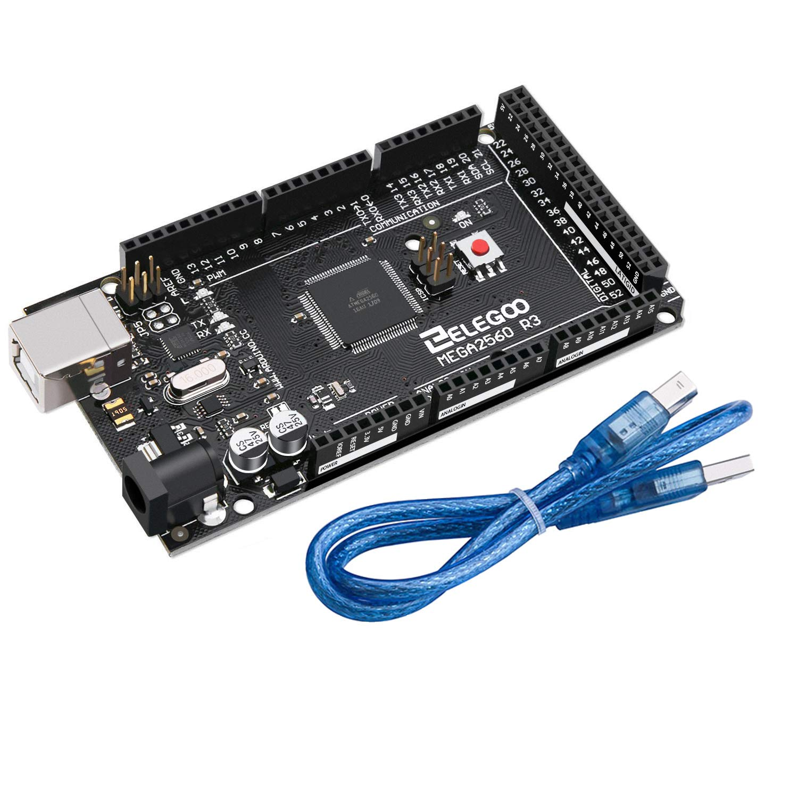
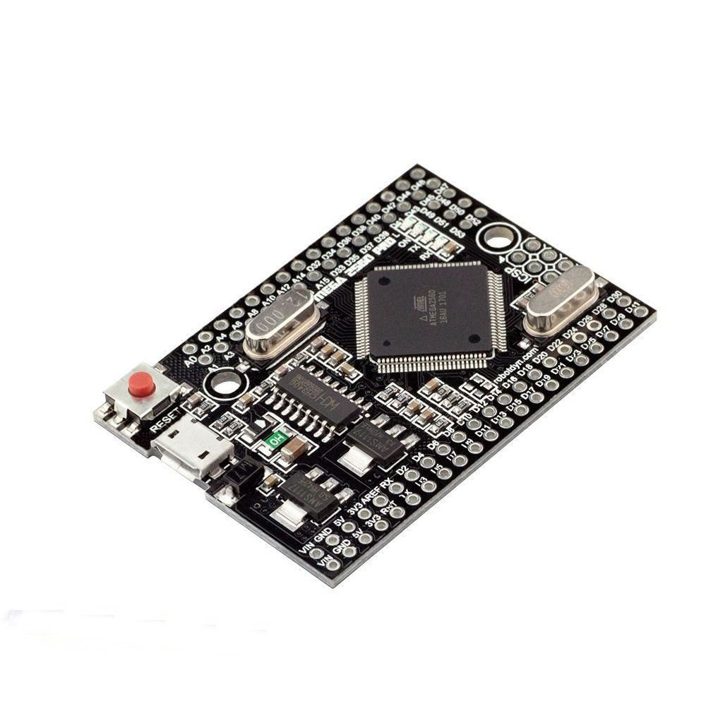
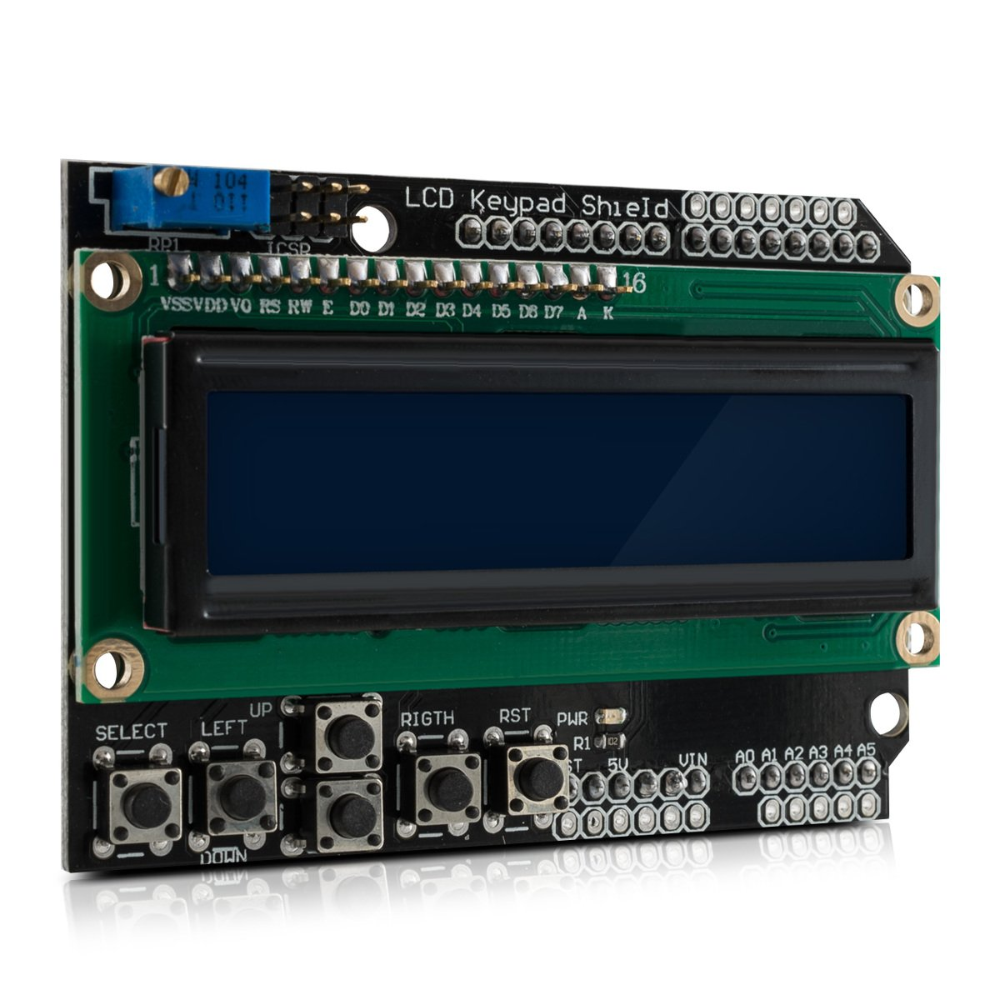
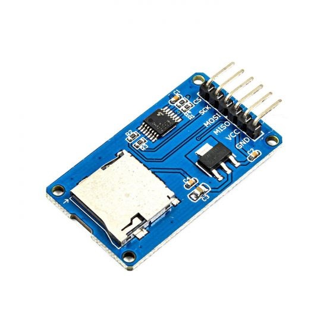
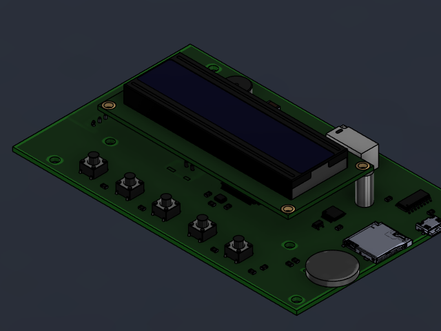
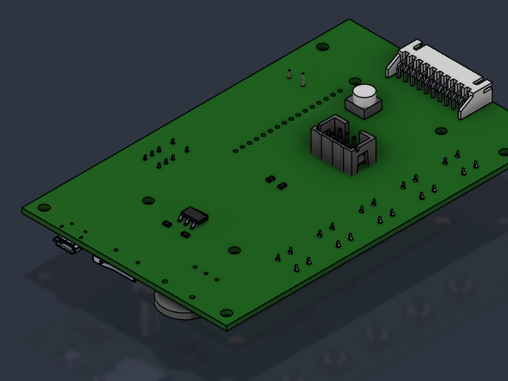
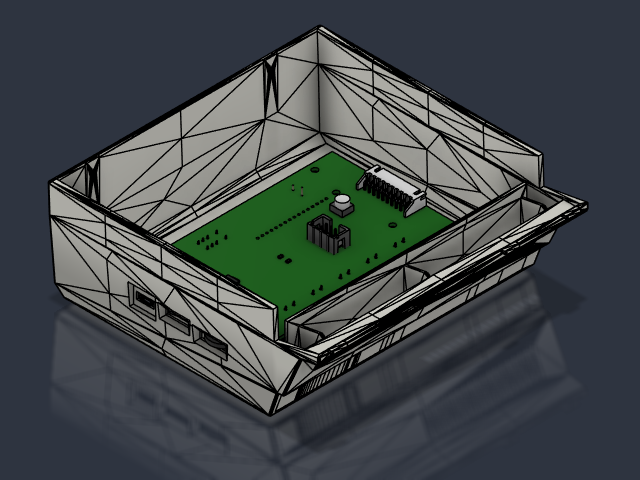

# MZ-SD2CMT2 - Reborn

**Extended SD-card CMT emulator / recorder for the Sharp MZ-800**  
**Firmware 1.0**

<p align="center">
  
</p>

> **MZ-SD2CMT2 is based directly on the original [MZ-SD2CMT](https://github.com/SHARPENTIERS/MZ-SD2CMT) project by Christophe Avoinne (hlide).**  
> The purpose of MZ-SD2CMT2 is to **continue and extend the original project**: improve the firmware and user interface, add playback and recording capabilities, and provide an optional integrated hardware implementation, while preserving compatibility with the original modular hardware concept.

The primary target is the **Sharp MZ-800**. The project acts as a solid-state CMT replacement using an SD card, but its design goal is not only functional replacement: the dedicated hardware version is also intended to look and feel at home next to original Sharp MZ equipment.

## Project goals

MZ-SD2CMT2 has three main goals: **preserve compatibility with the original MZ-SD2CMT modular hardware**, extend the firmware with additional playback/recording features, and provide an optional dedicated PCB and enclosure for a cleaner stand-alone build.

The dedicated version remains based on the same core CMT interface, but adds convenience hardware and a mechanical design inspired by original Sharp MZ cassette equipment.

## Main features

- SD-card file browser with alphabetical sorting, folders and long-name scrolling
- playback of **MZF, MZT, M12, WAV, LEP, L16 and TAP**
- recording to **MZF, WAV, LEP and L16**
- WAV recording at **44.1 kHz or 22.05 kHz, 8-bit mono**
- recording control by **MOTOR**, automatic activity detection, or manual control
- optional **AutoName**: automatic naming of recordings from detected Sharp MZ tape metadata
- live recognition/display of several normal and turbo tape profiles while recording
- multiple Sharp MZ tape timing and loader profiles, including NORMAL, MZ-700, InterCopy and Turbo Copy families
- **Ultra Fast** loading for compatible MZF files
- selectable ZX Spectrum **TAP playback speed**
- **MFI metadata for MZF** and **MTI per-record metadata for MZT**
- **MZT mini-browser / record selector** showing logical record number, title, loader/profile and per-record duration
- independent loader/profile selection for every logical record inside an MZT
- browser `I` indicator when matching MFI/MTI playback information is available
- MFI/MTI files hidden from normal browser entry counts and sorting
- automatic sound-monitor activity during physical tape waveform playback/recording
- persistent hardware, playback and recording settings stored in EEPROM
- SD-card insertion/removal handling on supported dedicated hardware
- selectable internal MZ-SD2CMT2 / external physical CMT path on supported dedicated hardware

This README is intentionally a **project overview rather than a complete operating manual**.

For normal use see:

- [User Handbook](guide/USER_HANDBOOK.md)
- [Quick Reference Guide](guide/QUICK_REFERENCE_GUIDE.md)

For metadata syntax see:

- [MFI / MTI playback metadata](guide/MFI_MTI_FORMAT.md)

## Playback overview

### Normal files

Browse to a file and press **PLAY**.

Supported playback formats are:

| Format | Purpose |
|---|---|
| **MZF** | canonical single Sharp MZ program image |
| **MZT** | container with multiple logical MZF records |
| **M12** | supported Sharp tape-format variant |
| **WAV** | sampled tape waveform |
| **LEP** | pulse-duration representation using a 50 µs unit |
| **L16** | pulse-duration representation using a 16 µs unit |
| **TAP** | ZX Spectrum TAP playback |

The normal recommended starting point for Sharp MZ software is:

```text
PLAY CTRL = MOTOR
LOADER    = NORMAL
SPEED     = 1:1
```

When a library contains matching MFI/MTI files, use:

```text
PLAY CTRL = MOTOR
LOADER    = AUTO
```

### MZT mini-browser / record selector

An MZT is not started immediately as one long stream. Opening an MZT first enters a lightweight **record selector**.

Example:

```text
+----------------+
|2I5 PACMAN     █|
|MTI N13 01:27   |
+----------------+
```

The selector shows:

- selected logical record and total record count
- title from the selected MZF header
- the resolved loader/profile for that record
- the nominal duration of that record when known

Controls:

```text
FFWD   = previous record
REWIND = next record
PLAY   = confirm/start selected record
STOP   = return to main browser
```

The selector wraps from the first record to the last and vice versa.

During playback, **STOP** returns first to the MZT selector. A second **STOP** returns to the main SD browser.

Each logical MZT record is treated independently. Its title, loader/profile and duration are recalculated for that record rather than applying one global setting to the whole MZT.

Ultra Fast records are also treated as independent LOAD operations. After an Ultra Fast record completes, the next MZT record is not injected automatically: MOTOR mode waits for a new MOTOR cycle and MANUAL mode waits for a new PLAY confirmation.

## MFI and MTI playback metadata

External playback metadata use two explicit sidecar formats:

```text
GAME.MZF  -> GAME.MFI
TAPE.MZT  -> TAPE.MTI
```

There is **no external `.MZI` fallback**. The internal source module still uses the historical `mzi_sidecar.*` name, but files on the SD card are MFI/MTI.

### MFI - one MZF

Example:

```ini
TYPE=NORMAL
SPEED=1:3
```

MFI is used when:

```text
LOADER = AUTO
```

If a loader is selected manually, the manual selection has priority.

### MTI - per-record information for MZT

Each logical record can have its own playback profile:

```ini
RECORD=1
TYPE=NORMAL
SPEED=1:1

RECORD=2
TYPE=IC
SPEED=1:3

RECORD=3
TYPE=TC
SPEED=1:3

RECORD=4
TYPE=UL_MZ800
```

This is particularly useful for multi-part games where the bootstrap, main program and later level/data records do not use the same loader.

Current supported metadata families include:

| TYPE | SPEED |
|---|---|
| `NORMAL` | `1:1`, `1:2`, `1:3`, `1:4` |
| `MZ700` | `1:1`, `1:3` |
| `IC` | `1:1`, `1:2`, `1:3`, `1:4` |
| `TC` | `1:1`, `1:2`, `1:3` |
| `UL` | no SPEED |
| `UL_MZ800` | no SPEED |
| `UL_MZ700` | no SPEED |

`TC 1:4` is intentionally not defined in the current firmware.

If an MTI file or a particular `RECORD=n` section is missing/invalid, that record falls back independently to `NORMAL 1:1`. Other MZT records are resolved again from their own metadata.

### Browser information indicator

MFI and MTI files themselves are hidden from the normal browser and do not count as visible entries.

A normal browser counter:

```text
3/28
```

changes to:

```text
3I28
```

when matching playback information exists for the highlighted MZF/MZT.

For MZT, the same `I` convention is also used in the logical record counter when MTI information is available.

## Recording overview

Recording formats:

| Format | Record |
|---|---:|
| **MZF** | yes |
| **WAV 44.1 kHz** | yes |
| **WAV 22.05 kHz** | yes |
| **L16** | yes |
| **LEP** | yes |

Recording modes:

- **MOTOR** - follows the Sharp MOTOR signal
- **AUTO** - starts on detected signal activity and finishes after inactivity
- **MANUAL** - controlled by the user

All normal captures are written to:

```text
/RECORDINGS
```

A short **STOP** finishes and saves an active recording. A long **STOP** cancels it and deletes an already-created capture file.

AutoName can decode a valid incoming header, display the detected title/profile during capture and rename the provisional `RECxxxx` file after a successful save.

## Loader/profile families

The user-facing loader families include:

- **NORMAL** - normal Sharp MZ timing family, 1:1 through 1:4
- **MZ700** - MZ-700 1:1 and FAST3 / 1:3
- **IC** - InterCopy-family profiles, 1:1 through 1:4
- **TC** - Turbo Copy profiles, 1:1 through 1:3
- **UL** - Ultra Fast with automatic target/placement handling
- **UL MZ800** - MZ-800-specific Ultra Fast
- **UL MZ700** - MZ-700-specific Ultra Fast
- **AUTO** - resolve MFI/MTI when present, otherwise use safe fallback behaviour

Compact LCD labels include `N11`..`N14`, `M71`, `M73`, `IC1`..`IC4`, `TC1`..`TC3`, `UL`, `UL8` and `UL7`.

## Hardware variants

### 1. Original-compatible modular build

The original MZ-SD2CMT concept is deliberately retained as a fully supported hardware option. MZ-SD2CMT2 can therefore be built from readily available modules without the dedicated PCB. This is useful for reproducing the original project, experimenting with the firmware, or building a compact version from standard parts.

The modular implementation uses the same basic building blocks as MZ-SD2CMT: an ATmega2560 board, a 16×2 LCD/keypad interface, an SPI SD-card module and the four Sharp MZ CMT signals. Two ATmega2560 board styles are practical:

- a standard **Arduino Mega 2560 R3**, which can accept the LCD Keypad Shield directly,
- a compact **Mega 2560 Pro Mini / Mini Mega**, which provides the same ATmega2560 resources in a much smaller module and is convenient for a self-contained enclosure.

#### Arduino Mega 2560 R3

<p align="center">
  
</p>

The full-size Mega 2560 follows the most straightforward construction style: the LCD Keypad Shield can be fitted directly on the Arduino headers and the SD-card module and CMT signals are connected with wiring. This is the closest arrangement to the original MZ-SD2CMT module-based implementation.

**What to look for when buying:** a full-size **Mega 2560 R3-compatible 5 V / 16 MHz board** with the ATmega2560 and the standard Mega shield header layout. The photograph above is a real board and is intended as a visual identification aid.

#### Mini Mega / Mega 2560 Pro Mini

<p align="center">
  
</p>

The compact Mini Mega version keeps the ATmega2560 platform while reducing the physical size substantially. It is especially suitable when the modular electronics are to be placed in a small stand-alone case rather than left as separate development boards.

**What to look for when buying:** this board is commonly listed as **Mega 2560 Pro Mini**, **Mini Mega 2560**, **Mega Pro Embed** or similar. Choose the **ATmega2560, 5 V, 16 MHz** version. The photograph above shows the compact board style used as the reference for this project.

For this version the repository already contains printable enclosure parts in the `STL/KeypadShield` directory:

- [`STL/KeypadShield/Cover.stl`](STL/KeypadShield/Cover.stl) - enclosure/cover
- [`STL/KeypadShield/Button.stl`](STL/KeypadShield/Button.stl) - printable button part

These STL files allow the Mini Mega + keypad-shield implementation to be built as a compact finished unit while still using the original modular electrical concept.

#### 16x2 LCD Keypad Shield

<p align="center">
  
</p>

The firmware retains support for the familiar 16x2 LCD with five analogue-keypad buttons. The keypad shield provides the display and the basic navigation/transport controls without requiring a custom front-panel PCB.

**What to look for when buying:** the common **1602 / HD44780-compatible LCD Keypad Shield** with five navigation buttons read through the analogue resistor ladder on **A0**. The real photograph above matches the classic shield style used by the original MZ-SD2CMT project.

#### SD-card module

<p align="center">
  
</p>

The modular build uses a standard SPI SD-card adapter with 5 V-compatible level shifting. On the Mega 2560 the hardware SPI interface is connected through pins **50-53** (`MISO`, `MOSI`, `SCK`, `SS/CS`).

**What to look for when buying:** use an **SD-card SPI module intended for 5 V Arduino boards**, with an onboard **3.3 V regulator and logic-level conversion**. The original-style full-size module usually exposes `GND`, `3.3V`, `5V`, `CS/SDCS`, `MOSI`, `SCK`, `MISO` and `GND`. The real photograph above is included as a visual guide; modules with the same electrical function may have a different PCB colour or layout.

Connection details for the Sharp MZ CMT interface are collected in the dedicated **CMT interface and compatibility** section below, so the wiring reference is shown only once in this README.

### 2. Dedicated MZ-SD2CMT2 hardware

The dedicated hardware combines the electronics into a purpose-built unit and adds:

- **SD-card presence detection**, allowing the firmware to detect card insertion/removal instead of relying only on failed file access
- a selectable **internal MZ-SD2CMT2 / external CMT path**, allowing a real external cassette recorder or another CMT source to remain connected and be selected without rewiring
- **audio monitoring** of the tape signal during playback and recording
- integrated connectors and wiring intended for a permanent installation
- a dedicated mechanical arrangement for the LCD, five control buttons, SD-card access and CMT connections

#### USB programming from PlatformIO

The dedicated PCB is designed so that the Mega/ATmega2560 firmware can be programmed and updated through the **USB connection directly from PlatformIO**. For normal firmware updates this avoids the need to connect a separate ISP programmer.

> **Important:** direct USB upload requires an **Arduino Mega 2560-compatible bootloader** to be present in the ATmega2560. If a blank/replacement ATmega2560 is fitted, or the Mega module does not contain the bootloader, the Arduino Mega 2560 bootloader must first be programmed via **ISP**. Once the bootloader is installed, subsequent firmware uploads can be performed normally through USB using PlatformIO/AVRDUDE.

#### Mechanical design

A major goal of the dedicated version is for the finished device to **visually resemble an original Sharp MZ CMT/cassette unit as closely as is practical**, rather than looking like a generic Arduino box.

The enclosure is therefore designed around the visual language of period Sharp hardware: a low, slightly wedge-shaped body, an inclined upper control panel, a recessed display area, a row of transport-style controls and horizontal grille/vent details. The intention is **not to make an exact 1:1 reproduction of a specific Sharp cassette mechanism**, but to create a modern SD-based CMT replacement that looks appropriate beside an MZ-800 and preserves the character of the original equipment.

The dedicated PCB is designed together with the enclosure, so the positions of the display, buttons, SD-card access and connectors are part of the mechanical concept rather than an afterthought.

For the dedicated PCB version, the repository contains the matching **3D-printable mechanical parts** in the [`STL/PCB`](STL/PCB) directory:

- [`STL/PCB/Cover.stl`](STL/PCB/Cover.stl) - enclosure cover
- [`STL/PCB/Distancer.stl`](STL/PCB/Distancer.stl) - mechanical spacer
- [`STL/PCB/FFD_REW.stl`](STL/PCB/FFD_REW.stl) - fast-forward / rewind control
- [`STL/PCB/Play.stl`](STL/PCB/Play.stl) - PLAY control
- [`STL/PCB/Rec.stl`](STL/PCB/Rec.stl) - REC control
- [`STL/PCB/Stop.stl`](STL/PCB/Stop.stl) - STOP control

These STL files form the mechanical counterpart to the dedicated PCB and allow the enclosure and transport-style controls shown below to be reproduced without having to design a separate case. There is a space between knobs and tact switches for double adhesive foam to dampen too much click feel.

<table>
<tr>
<td align="center"><b>PCB - component side</b></td>
<td align="center"><b>PCB - opposite side</b></td>
</tr>
<tr>
<td></td>
<td></td>
</tr>
</table>

<p align="center">
  
</p>

<p align="center"><em>Internal arrangement of the dedicated PCB below the upper control panel.</em></p>

## CMT interface and compatibility with MZ-SD2CMT

MZ-SD2CMT2 retains the CMT signal arrangement of the original MZ-SD2CMT project. This is the key hardware compatibility point that allows both the original-style modular build and the dedicated PCB to use the same firmware architecture.

<p align="center">
  
</p>

<p align="center"><em>Original MZ-SD2CMT 8255/CMT connection diagram and pin assignment.</em></p>

| Signal | Arduino Mega pin | Function |
|---|---:|---|
| `WRITE / SDI` | 15 | data from the Sharp MZ to the CMT interface |
| `MOTOR / SSI` | 16 | motor/control input from the Sharp MZ |
| `READ / SDO` | 2 | data from the CMT interface to the Sharp MZ |
| `SENSE / SSO` | 18 | tape sense/control output to the Sharp MZ |

These four signals are also used by the original MZ-SD2CMT Ultra-Fast transfer method. The dedicated MZ-SD2CMT2 PCB adds card detection, external-CMT switching and audio-monitor circuitry around this core interface without changing the basic connection concept.

> **Dedicated PCB schematic:** the electrical schematic of the MZ-SD2CMT2 board is kept with the project hardware files. The PCB/enclosure images in this README are mechanical/3D design renders, not the electrical schematic.

## Software structure

The current firmware targets the **ATmega2560**. Time-critical tape generation and capture use AVR timers and interrupts, while SD access, file parsing, UI and metadata processing run in the foreground.

The source tree is divided into functional areas including:

- `src/play` - playback engines, loaders and timing profiles
- `src/record` - WAV/LEP/L16/MZF recording and automatic naming
- `src/formats` - file-format detection, tape profiles and MFI/MTI sidecar handling
- `src/drivers` - LCD, keypad, SD card, CMT I/O, external-CMT switching and sound monitor
- `src/ui` - browser, MZT record selector, menus and transport screens

The internal sidecar implementation is still named `mzi_sidecar.*` for source compatibility, but the supported external metadata files are `.MFI` and `.MTI`.

## Documentation

- [User Handbook](guide/USER_HANDBOOK.md) - full operating instructions
- [Quick Reference Guide](guide/QUICK_REFERENCE_GUIDE.md) - basic controls and everyday operation
- [MFI / MTI playback metadata](guide/MFI_MTI_FORMAT.md) - sidecar syntax and selection rules
- [CMT timing reference](guide/CMT_TIMING_REFERENCE.md) - technical timing/calibration reference
- [InterCopy / Turbo Copy timing reference](guide/CMT_INTERCOPY_TURBOCOPY_TIMING_REFERENCE.md) - copier-specific timing analysis

## Origins, references and acknowledgements

MZ-SD2CMT2 builds on earlier work from the Sharp MZ and retro-computing community. The following projects, formats and authors were used either as a direct starting point or as technical references during development:

| Project / format | Author(s) | Contribution / relevance |
|---|---|---|
| **[MZ-SD2CMT](https://github.com/SHARPENTIERS/MZ-SD2CMT)** | **Christophe Avoinne (hlide)** / SHARPENTIERS | **Direct predecessor and primary foundation of MZ-SD2CMT2.** Hardware concept, Sharp MZ CMT interface, file playback and Ultra-Fast transfer work. |
| **MZF2LEP** ([included in MZ-SD2CMT](https://github.com/SHARPENTIERS/MZ-SD2CMT/tree/master/Tools/mzf2lep)) | **Christophe Avoinne (hlide)** | MZF-to-LEP/WAV conversion and Sharp MZ tape waveform/timing work. MZF2LEP itself was based on MZF2WAV. |
| **MZF2WAV** | **Jeroen F. J. Laros** | Earlier MZF-to-audio conversion code on which MZF2LEP was based. |
| **[SDLEP-READER / LEP format](https://dcmoto.pages-perso.free.fr/bricolage/sdlep-reader/index.html)** | **Daniel Coulom** | LEP pulse-duration format and SD-based virtual cassette reader concept. |
| **[ZX Spectrum TAP format](https://sinclair.wiki.zxnet.co.uk/wiki/TAP_format)** | ZX Spectrum community / historical TAP documentation | TAP block structure and ZX Spectrum tape encoding/timing reference used for TAP playback support. |
| **[mz800emu](https://github.com/michalhucik/mz800emu)** | **Michal Hucik (ordoz)** | Reference material for Sharp MZ hardware, CMT behaviour and file formats. |
| **[TapeMZ](https://github.com/michalhucik/TapeMZ)** | **Michal Hucik (ordoz)** | Research and implementation covering Sharp MZ tape formats, loaders, timing profiles, WAV analysis and the TMZ archival format. |

Special thanks to the original authors, maintainers and contributors. MZ-SD2CMT2 is intended to extend this body of work while preserving clear attribution to the projects from which code, ideas, file formats or technical information originated.

## Development status

Firmware 1.0 documents the current user-facing playback, MZT selection, MFI/MTI metadata and recording workflow described above. Timing profiles and hardware options continue to be tested on real Sharp MZ hardware.

## License

See [`LICENSE`](LICENSE).
