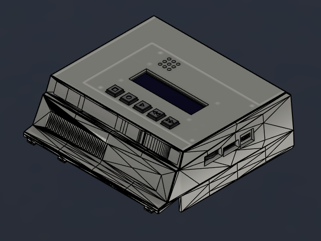
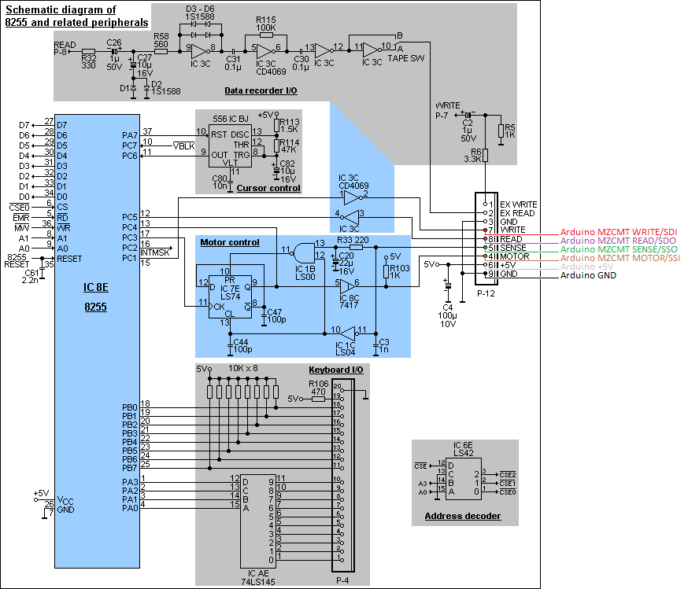
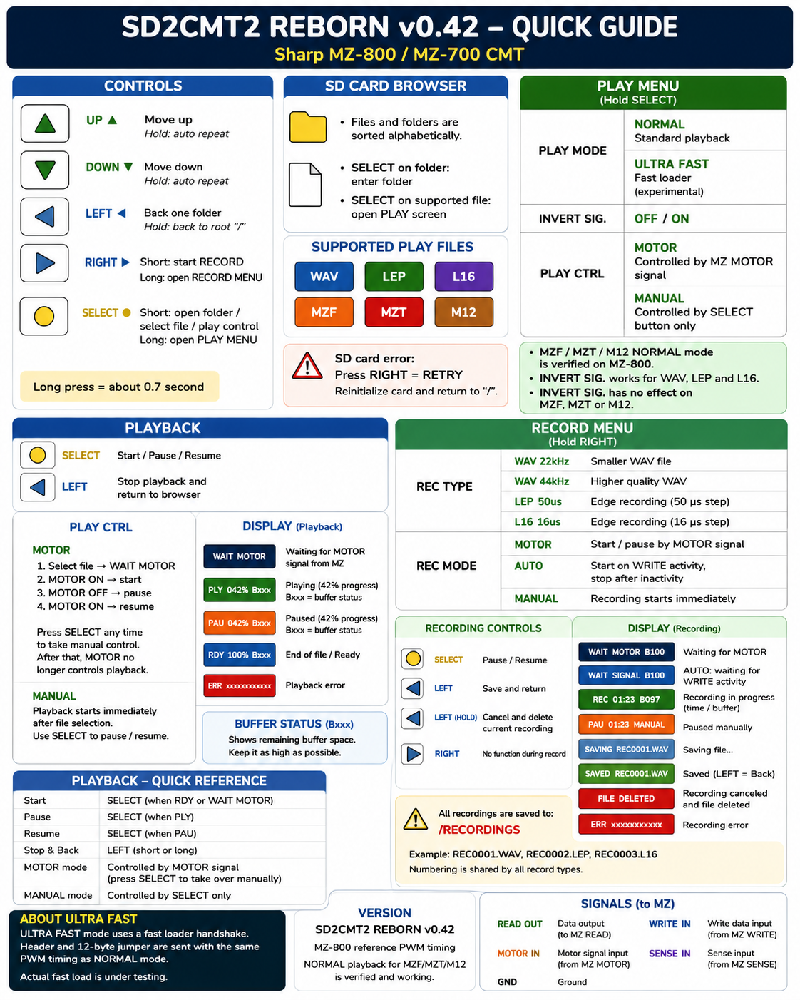

# MZ-SD2CMT2 – Reborn
## User Handbook

**Extended SD-card CMT emulator / recorder for Sharp MZ computers**  
**Handbook draft for firmware 0.9rc**

> **Draft status**
>
> This is the first full user-handbook draft. It is intentionally more detailed than the project README and is designed both for users who simply want to replace the cassette recorder and for experienced users who want to use loader profiles, MZT containers, MFI/MTI metadata, direct MZF recording, AutoName and diagnostic information.
>
> The layout and wording are intended to be refined before a later PDF edition. LCD examples in this Markdown version are text mock-ups of the real 16×2 display. In the final PDF they can be replaced or supplemented by graphical LCD renders and photographs.

<p align="center">
  
</p>

---

## Contents

1. [Who this handbook is for](#1-who-this-handbook-is-for)
2. [What MZ-SD2CMT2 does](#2-what-mz-sd2cmt2-does)
3. [Quick start – load your first MZF](#3-quick-start--load-your-first-mzf)
4. [Front-panel controls](#4-front-panel-controls)
5. [Understanding the 16×2 LCD](#5-understanding-the-162-lcd)
6. [Using the SD-card browser](#6-using-the-sd-card-browser)
7. [Supported file formats](#7-supported-file-formats)
8. [Playing files](#8-playing-files)
9. [PLAY settings](#9-play-settings)
10. [Loader modes and speed profiles](#10-loader-modes-and-speed-profiles)
11. [MFI and MTI metadata](#11-mfi-and-mti-metadata)
12. [MZT multi-record tapes](#12-mzt-multi-record-tapes)
13. [Recording](#13-recording)
14. [AutoName and automatic profile detection](#14-autoname-and-automatic-profile-detection)
15. [Understanding the buffer indicator](#15-understanding-the-buffer-indicator)
16. [System settings](#16-system-settings)
17. [Keypad calibration](#17-keypad-calibration)
18. [Recommended setups](#18-recommended-setups)
19. [Troubleshooting](#19-troubleshooting)
20. [Technical reference](#20-technical-reference)
21. [Quick-reference card](#21-quick-reference-card)
22. [Glossary](#22-glossary)

---

# 1. Who this handbook is for

MZ-SD2CMT2 can be used at two very different levels.

### If you only want a cassette replacement

You do **not** need to understand tape timing, loader profiles, MFI/MTI files or Ultra Fast loading. For normal use, read:

- Quick Start
- Front-panel controls
- SD-card browser
- Playing files
- the basic part of Recording
- Troubleshooting

A normal MZF can be treated very much like a cassette already inserted in a tape recorder: select it, let the Sharp request the tape, and allow MZ-SD2CMT2 to provide the signal.

### If you want the advanced features

Continue with:

- Loader modes and speed profiles
- Ultra Fast loading
- MZT containers
- MFI/MTI metadata
- direct MZF recording
- AutoName
- detected tape profiles
- buffer diagnostics
- MOTOR/AUTO/MANUAL capture modes

These functions allow MZ-SD2CMT2 to do considerably more than simply reproduce a cassette waveform.

---

# 2. What MZ-SD2CMT2 does

MZ-SD2CMT2 is a solid-state replacement and extension for the cassette/CMT interface used by the Sharp MZ family, with the **Sharp MZ-800 as the primary target**.

Instead of storing programs on magnetic tape, files are kept on an SD card. The device generates or reproduces the signal expected by the Sharp computer and can also capture data written by the Sharp back to the CMT interface.

The firmware supports:

- direct playback of **MZF**
- multi-record **MZT**
- **M12**
- waveform playback from **WAV**
- pulse/edge formats **LEP** and **L16**
- ZX Spectrum-style **TAP**
- recording to **MZF**
- recording to **WAV 44.1 kHz**
- recording to **WAV 22.05 kHz**
- recording to **L16**
- recording to **LEP**
- automatic naming from detected tape headers
- automatic recognition of several loader/tape profiles
- NORMAL and turbo playback profiles
- Ultra Fast loading
- MFI/MTI sidecar metadata
- MOTOR-controlled, AUTO-triggered and MANUAL playback/recording
- optional switching between the internal SD emulator and an external physical CMT unit

The original-compatible modular hardware and the dedicated PCB use the same basic Sharp CMT signals.

---

# 3. Quick start – load your first MZF

This is the shortest path for a user who simply wants to load software.

## 3.1 Prepare the SD card

Copy your MZF files to the SD card. Folders may be used to organise games, utilities and other software.

A simple example:

```text
/
├── GAMES/
│   ├── PACMAN.MZF
│   ├── MANICMIN.MZF
│   └── ...
├── BASIC/
└── DEMOS/
```

Insert the card and switch on MZ-SD2CMT2.

## 3.2 Browse to the program

The five front-panel buttons correspond to:

```text
FFWD     = up / previous
REWIND   = down / next
STOP     = back
RECORD   = record
PLAY     = select / play
```

Example browser display:

```text
+----------------+
|../GAMES    3/28|
|PACMAN.MZF      |
+----------------+
```

`3/28` means that the highlighted entry is item 3 of 28 visible entries in the current directory.

Press **PLAY** briefly to select `PACMAN.MZF`.

## 3.3 Load from the Sharp

With the default **PLAY CTRL = MOTOR** setting, MZ-SD2CMT2 waits for the Sharp computer to activate the cassette motor/control signal.

The display may show:

```text
+----------------+
|PACMAN.MZF     █|
|PAUSED         M|
+----------------+
```

The `M` in the final column means that playback is waiting because of **MOTOR control**.

Start the normal cassette load operation on the MZ-800. When the Sharp activates MOTOR, MZ-SD2CMT2 begins sending the tape data.

During normal playback:

```text
+----------------+
|PACMAN.MZF     █|
|PLY 00:08/01:42 |
+----------------+
```

`PLY` means playback is active. The time before `/` is elapsed time; the value after `/` is the nominal total duration.

## 3.4 Stop or leave playback

Press **STOP** to return to the browser.

For ordinary use, that is all you need to know.

---

# 4. Front-panel controls

MZ-SD2CMT2 uses the familiar five-button LCD Keypad Shield layout or equivalent dedicated front-panel buttons.

The firmware maps them as follows:

| Physical label | Logical function | Typical browser function |
|---|---|---|
| **FFWD** | UP | previous item |
| **REWIND** | DOWN | next item |
| **STOP** | LEFT / BACK | parent / back |
| **RECORD** | RIGHT | start recording |
| **PLAY** | SELECT | open / play / confirm |

The exact action depends on the current screen.

## 4.1 Browser shortcuts

| Button | Short press | Long press |
|---|---|---|
| FFWD | previous entry | repeated scrolling while held |
| REWIND | next entry | repeated scrolling while held |
| STOP | parent directory | from a subdirectory: root; from root: SYSTEM menu |
| RECORD | start recording with current settings | open RECORD settings |
| PLAY | enter directory or select file | open PLAY settings |

## 4.2 PLAY screen

| Button | Action |
|---|---|
| PLAY | start / pause / resume |
| STOP | stop and return; in MZT, first returns to the MZT record selector |
| FFWD | previous MZT record while the MZT selector is active |
| REWIND | next MZT record while the MZT selector is active |

## 4.3 RECORD screen

| Button | Action |
|---|---|
| PLAY | start manually when armed, or pause/resume an active recording |
| STOP short | finish and save |
| STOP long | cancel recording; if a capture file has already been created it is deleted |

> **Important:** long STOP while recording is **Cancel**, not normal Stop/Save.

---

# 5. Understanding the 16×2 LCD

The display has only sixteen characters per line, so several compact abbreviations are used.

This chapter is deliberately detailed. Once the display conventions are understood, diagnosing playback and recording becomes much easier.

---

## 5.1 The graphical buffer column

During active PLAY or RECORD, the **last LCD column** is normally reserved for a custom vertical bar character.

In the text examples in this handbook it is represented as:

```text
▁  low
▃
▅
▇
█  high
```

The real HD44780 LCD uses a custom vertical-fill character rather than these Unicode blocks.

### The important rule

**A high bar is healthy. A very low bar deserves attention.**

The internal meaning differs between PLAY and RECORD:

- during **PLAY**, the bar represents how much source data is already buffered and ready for output;
- during **RECORD**, it represents **buffer headroom** – how much safe free capacity remains.

This difference is explained in detail in [Understanding the buffer indicator](#15-understanding-the-buffer-indicator).

---

## 5.2 Browser display

At the root directory:

```text
+----------------+
|/           1/42|
|GAMES           |
+----------------+
```

Inside a directory:

```text
+----------------+
|../GAMES    3/28|
|PACMAN.MZF      |
+----------------+
```

### Browser line 1

The first line contains:

- `/` at root, or `../` inside a directory;
- the current directory name when space permits;
- position `current/total` at the right.

For example:

```text
3/28
```

means third visible item out of 28.

The browser is alphabetically sorted.

### `I` instead of `/` in the counter

If the highlighted MZF or MZT has matching playback metadata, the separator changes.

Normal:

```text
3/28
```

Metadata available:

```text
3I28
```

The `I` means an information sidecar exists:

- `.MFI` for an `.MZF`
- `.MTI` for an `.MZT`

Example:

```text
+----------------+
|../GAMES    3I28|
|PACMAN.MZF      |
+----------------+
```

The metadata files themselves are hidden from normal browsing.

---

## 5.3 Browser status screens

### SD card removed

```text
+----------------+
|INSERT CARD     |
|                |
+----------------+
```

### SD card error

```text
+----------------+
|SD CARD ERROR   |
|RECORD=RETRY    |
+----------------+
```

Press **RECORD** to retry SD initialization.

### Reinitializing

```text
+----------------+
|SD INIT         |
|                |
+----------------+
```

### Empty directory

```text
+----------------+
|../EMPTY     0/0|
|EMPTY           |
+----------------+
```

### Name too long

```text
+----------------+
|NAME TOO LONG   |
|                |
+----------------+
```

### Path too long

```text
+----------------+
|PATH TOO LONG   |
|                |
+----------------+
```

---

## 5.4 Standard PLAY display

Example:

```text
+----------------+
|PACMAN.MZF     █|
|PLY 00:12/01:42 |
+----------------+
```

### Line 1

The first fifteen columns contain the filename. Long names scroll horizontally.

The final column is the playback buffer bar.

### Line 2

`PLY` = actively playing.

```text
PLY 00:12/01:42
```

means:

- `PLY` – playback active
- `00:12` – 12 seconds elapsed
- `/`
- `01:42` – nominal total time 1 minute 42 seconds

---

## 5.5 `RDY`, `PLY`, `PLA`, `PAU`, `ERR`

The PLAY screen can use the following state abbreviations:

| Display | Meaning |
|---|---|
| `RDY` | source prepared / ready |
| `PLY` | playing |
| `PLA` | playing using loader information selected automatically from MFI/MTI metadata |
| `PAU` | paused |
| `ERR` | playback error |

`PLA` is useful because it confirms that **AUTO** actually selected the loader profile from the information sidecar rather than merely falling back to a default.

Example:

```text
+----------------+
|MFI PACMAN.MZF █|
|PLA 00:04/00:31 |
+----------------+
```

The `MFI` prefix shows that the MZF loader profile is being taken from the matching `.MFI`.

---

## 5.6 User pause and MOTOR pause

The **last character of line 2** may indicate why playback is paused.

### User pause

```text
+----------------+
|PACMAN.MZF     █|
|PAU 00:17/01:42U|
+----------------+
```

`U` = **User pause**.

The user pressed PLAY to pause the stream.

### MOTOR pause

```text
+----------------+
|PACMAN.MZF     █|
|PAU 00:17/01:42M|
+----------------+
```

`M` = **Motor pause**.

The Sharp computer lowered the MOTOR signal and MZ-SD2CMT2 paused automatically.

### Waiting for MOTOR before playback begins

```text
+----------------+
|PACMAN.MZF     █|
|PAUSED         M|
+----------------+
```

This is not an error. The file is prepared and MZ-SD2CMT2 is waiting for the computer.

---

## 5.7 Manual override of a MOTOR pause

In MOTOR mode, an active stream normally follows the Sharp MOTOR signal.

If playback has already been paused because MOTOR went LOW, pressing **PLAY** is an explicit user override and resumes playback even while MOTOR is still LOW.

The override lasts until MOTOR goes HIGH again. After that, normal MOTOR control is re-armed and the next LOW will pause the stream again.

This is useful for testing and unusual software, but normal users can simply let the computer control the transport.

---

## 5.8 Percentage PLAY display

Formats for which an exact nominal time is not the most useful representation use a percentage.

Example:

```text
+----------------+
|PROGRAM.L16    █|
|PLY        045% |
+----------------+
```

The percentage shows progress through the current source.

---

## 5.9 Turbo/Ultra-Fast phase display

Some generated Sharp tape profiles expose an internal phase label.

Example:

```text
+----------------+
|GAME.MZF       █|
|PLY UL     063% |
+----------------+
```

The three-character phase field is diagnostic. It shows which portion of a multi-stage loader is currently being sent.

Possible phase labels include:

| Phase | Meaning |
|---|---|
| `NLL` | Ultra-Fast bootstrap/normal-loader phase using LOW placement |
| `NLH` | Ultra-Fast bootstrap/normal-loader phase using HIGH placement |
| `HLL` | Ultra-Fast header phase using LOW placement |
| `HLH` | Ultra-Fast header phase using HIGH placement |
| `U7L` | MZ-700 Ultra-Fast loader phase, LOW placement |
| `U7H` | MZ-700 Ultra-Fast loader phase, HIGH placement |
| `ICL` | IC turbo loader stage |
| `IC` | IC turbo data stage |
| `TC` | Turbo Copy loader/data stage |
| `F3L` | MZ-700 FAST3 stage, LOW placement |
| `F3H` | MZ-700 FAST3 stage, HIGH placement |
| `UL` | Ultra-Fast handshake/data stage |

These abbreviations are intended mainly as diagnostics. A normal user does not need to react to them.

---

## 5.10 MZT selector display

Opening an MZT does **not** immediately begin record 1. It first opens a small record selector.

Example without MTI metadata:

```text
+----------------+
|2/5 PACMAN     █|
|SEL N13 01:27   |
+----------------+
```

Meaning:

- `2/5` – record 2 of 5
- `PACMAN` – title from that record's MZF header
- `SEL` – AUTO mode, but no MTI profile is being applied
- `N13` – NORMAL 1:3 for this record
- `01:27` – nominal duration

### MZT with MTI metadata

```text
+----------------+
|2I5 PACMAN     █|
|MTI N13 01:27   |
+----------------+
```

`I` and `MTI` confirm that the record has been resolved using the `.MTI` sidecar.

### Manually forced loader

```text
+----------------+
|2I5 PACMAN     █|
|MAN TC3 00:36   |
+----------------+
```

`MAN` means the user selected a loader manually in PLAY settings, so the manual setting has priority over MTI.

### Duration not known

Ultra Fast payload timing is handshake-driven and may not have a predictable duration.

```text
+----------------+
|2I5 PACMAN     █|
|MTI UL   --:--  |
+----------------+
```

---

## 5.11 Compact loader labels used by MZT

| LCD | Loader |
|---|---|
| `N11` | NORMAL 1:1 |
| `N12` | NORMAL 1:2 |
| `N13` | NORMAL 1:3 |
| `N14` | NORMAL 1:4 |
| `M71` | MZ700 1:1 |
| `M73` | MZ700 FAST3 / 1:3 |
| `IC2` | IC 1:2 |
| `IC3` | IC 1:3 |
| `IC4` | IC 1:4 |
| `TC2` | Turbo Copy 1:2 |
| `TC3` | Turbo Copy 1:3 |
| `TC4` | Turbo Copy 1:4 |
| `UL` | classic Ultra Fast |
| `UL8` | Ultra Fast forced for MZ-800 |
| `UL7` | Ultra Fast forced for MZ-700 |

---

## 5.12 Basic RECORD display

WAV example:

```text
+----------------+
|REC0001.WAV 44k█|
|REC 00:12       |
+----------------+
```

Line 1 contains:

- provisional filename
- WAV sample-rate abbreviation
- buffer-headroom bar in the last column

`44k` means 44.1 kHz mode.

At 22.05 kHz:

```text
+----------------+
|REC0001.WAV 22k█|
|REC 00:12       |
+----------------+
```

For LEP, L16 or MZF the sample-rate suffix is not used.

---

## 5.13 RECORD armed states

### MOTOR mode, waiting for MOTOR

```text
+----------------+
|REC0001.MZF    █|
|PAUSED         M|
+----------------+
```

`M` means waiting on the Sharp MOTOR signal.

### AUTO mode, waiting for the first signal activity

```text
+----------------+
|REC0001.WAV 44k█|
|WAIT SIGNAL     |
+----------------+
```

No file capture begins until signal activity is detected.

---

## 5.14 RECORD pause indicators

### User pause

```text
+----------------+
|REC0001.L16    █|
|PAU 00:24      U|
+----------------+
```

`U` = paused by the user.

### Motor pause

```text
+----------------+
|REC0001.L16    █|
|PAU 00:24      M|
+----------------+
```

`M` = paused because MOTOR is LOW.

A user pause has priority over MOTOR. If the user pauses recording manually, a later MOTOR HIGH does not silently resume it.

---

## 5.15 Detected profile and payload progress

When AutoName/profile detection has recognized a tape format and the payload length is known, the second line changes from elapsed time to profile + progress.

Example:

```text
+----------------+
|PACMAN         █|
|REC NRL 1:2 45% |
+----------------+
```

When paused:

```text
+----------------+
|PACMAN         █|
|PAU NRL 1:2 45%M|
+----------------+
```

The positions are fixed:

```text
columns: 1234567890123456
         REC NRL 1:2 45% 
         PAU NRL 1:2 45%M
```

The final column is reserved for `M`, `U` or another pause reason.

### Important: 100% does not necessarily mean recording has stopped

Example:

```text
+----------------+
|PACMAN         █|
|REC NRL 1:2 100%|
+----------------+
```

`100%` means the **declared detected payload length has been received**.

It does **not** necessarily mean the recorder has finished:

- MANUAL recording may continue;
- AUTO recording may still be keeping the five-second idle tail;
- the system may still be finalizing the file.

To avoid confusion, `REC` blinks after detected payload progress reaches 100% while the engine is still genuinely recording.

---

## 5.16 Detected record-profile abbreviations

| LCD | Meaning |
|---|---|
| `NRL 1:1` | detected normal Sharp MZ tape at 1:1 |
| `NRL 1:2` | detected normal Sharp MZ tape at 1:2 |
| `NRL 1:3` | detected normal Sharp MZ tape at 1:3 |
| `NRL 1:4` | detected normal Sharp MZ tape at 1:4 |
| `MZ7 1:1` | detected MZ-700 profile 1:1 |
| `MZ7 1:3` | detected MZ-700 FAST3 profile |
| `IC 1:2` etc. | detected IC/InterCopy-family profile |
| `TC 1:2` etc. | detected Turbo Copy profile |
| `SIN 1:x` | detected Sinclair-style auxiliary tape profile |
| `CPM 1:x` | detected CP/M/CMT-style auxiliary profile |

The detected profile is informational and also helps MZ-SD2CMT2 preserve the intended playback characteristics when appropriate.

---

## 5.17 Saving and saved screens

While the file is being finalized:

```text
+----------------+
|SAVING PACMAN   |
|NRL 1:2     WAIT|
+----------------+
```

or, when no profile was detected:

```text
+----------------+
|SAVING REC0001  |
|PLEASE WAIT     |
+----------------+
```

After a successful save:

```text
+----------------+
|SVD PACMAN.MZF  |
|NRL 1:2         |
+----------------+
```

Long filenames scroll while the fixed `SAVING ` or `SVD ` prefix remains visible.

---

## 5.18 Cancel screens

If recording had already created a file and long STOP cancels it:

```text
+----------------+
|FILE DELETED    |
|                |
+----------------+
```

If recording was cancelled before a capture file existed:

```text
+----------------+
|REC CANCELLED   |
|                |
+----------------+
```

---

## 5.19 Record error

```text
+----------------+
|REC ERROR       |
|MZF OVERFLOW    |
+----------------+
```

The second line contains the specific error when available.

---

# 6. Using the SD-card browser

The browser displays only user-relevant media entries. Playback metadata such as `.MFI` and `.MTI` is hidden.

## 6.1 Moving through entries

- FFWD = previous
- REWIND = next
- holding either button repeats
- moving past the first/last entry wraps around

The browser inserts a short pause before wrapping during repeated scrolling so that holding the button does not immediately run through the end of the list.

## 6.2 Entering and leaving directories

Press PLAY on a directory to enter it.

Press STOP briefly to go to the parent.

Press STOP long in a subdirectory to return directly to root.

At root, long STOP opens SYSTEM settings.

## 6.3 Long filenames

Long names scroll after a short hold.

The current directory name can also scroll independently on line 1.

## 6.4 SD card removal and reinsertion

The dedicated hardware can detect media removal.

If the card is removed:

```text
INSERT CARD
```

is shown.

During active PLAY, media removal aborts the stream safely. Reinserting the card causes reinitialization; MZT attempts to return to the previously prepared record selector, while a normal file is prepared again rather than blindly resumed from a stale buffer.

---

# 7. Supported file formats

| Format | Play | Record | Purpose |
|---|---:|---:|---|
| **MZF** | yes | yes | canonical Sharp MZ single-file image |
| **MZT** | yes | no | container with multiple logical MZF records |
| **M12** | yes | no | Sharp tape-format variant supported by playback |
| **WAV** | yes | yes | sampled physical tape waveform |
| **LEP** | yes | yes | compact pulse-duration representation, 50 µs unit |
| **L16** | yes | yes | finer pulse-duration representation, 16 µs unit |
| **TAP** | yes | no | ZX Spectrum TAP playback |

## 7.1 MZF

Best choice for ordinary Sharp software when a clean logical program image is available.

Advantages:

- small
- fast to browse
- can use generated loader/timing profiles
- supports MFI metadata
- can be recorded directly from a valid Sharp tape stream

## 7.2 MZT

A virtual multi-record tape.

An MZT may contain several logical MZF records. MZ-SD2CMT2 presents them through a mini-browser and can apply a different MTI loader profile to each record.

## 7.3 WAV

Stores a sampled representation of the tape signal.

WAV is useful for:

- compatibility with audio tools
- preserving a signal-like representation
- archiving
- analysis

MZ-SD2CMT2 records mono WAV at either:

- 44.1 kHz
- 22.05 kHz

### Hardware-speed limitation

> **Important:** WAV recording with AutoName / live metadata recognition is supported only up to approximately the **1:2** tape-speed profile because of the ATmega2560 real-time processing and buffering limits.
>
> Do not rely on WAV + AutoName/profile recognition for 1:3 or 1:4 signals. For faster signals use a more suitable direct/edge-oriented recording path where possible.

This limitation should be considered a design boundary, not an SD-card formatting problem.

## 7.4 LEP

Pulse-duration format using a 50 µs unit.

Good when a pulse representation is preferred over a sampled WAV while retaining physical tape timing.

## 7.5 L16

Pulse-duration format using a 16 µs unit.

L16 provides finer timing resolution than LEP and is a useful archival/intermediate format for fast or timing-sensitive tape signals.

## 7.6 TAP

ZX Spectrum TAP playback is supported with selectable bit rates:

- 1400 Bd
- 1800 Bd
- 2100 Bd
- 2500 Bd

TAP speed is independent from the Sharp loader SPEED setting.

---

# 8. Playing files

## 8.1 Select a file

Browse to the file and press PLAY.

MZ-SD2CMT2 detects the format from the extension.

Unknown extensions show:

```text
UNSUPPORTED
```

## 8.2 MOTOR playback

Default mode:

```text
PLAY CTRL
MOTOR
```

MZ-SD2CMT2 follows the Sharp MOTOR signal.

This is the most cassette-like behaviour and the recommended default.

## 8.3 MANUAL playback

```text
PLAY CTRL
MANUAL
```

The source starts immediately when selected/confirmed.

The Sharp MOTOR signal does not automatically control playback.

Use this for:

- diagnostics
- software with unusual MOTOR behaviour
- non-Sharp targets
- testing generated signals

## 8.4 Pause/resume

PLAY toggles pause/resume.

The reason is shown by:

- `U` – user
- `M` – motor

## 8.5 End of file

End of file leaves the source ready rather than automatically looping forever.

A later PLAY can re-prepare and start the source again.

---

# 9. PLAY settings

From the browser, **long PLAY** opens the PLAY menu.

Use:

- FFWD / REWIND to move through settings
- PLAY to change the selected setting
- STOP to return

Settings are stored persistently.

---

## 9.1 WAV INVERT

```text
+----------------+
|>WAV INVERT     |
| ON             |
+----------------+
```

or

```text
+----------------+
|>WAV INVERT     |
| OFF            |
+----------------+
```

This compensates the polarity of a WAV source when required.

It applies to WAV input/playback interpretation. Generated Sharp MZF/MZT signals use loader-defined polarity and do not use this setting.

---

## 9.2 PLAY CTRL

```text
+----------------+
|>PLAY CTRL      |
| MOTOR          |
+----------------+
```

or:

```text
+----------------+
|>PLAY CTRL      |
| MANUAL         |
+----------------+
```

Recommended default: **MOTOR**.

---

## 9.3 LOADER

Available choices:

```text
NORMAL
AUTO
UL
UL MZ800
UL MZ700
MZ700
IC
TC
```

The next chapter explains them.

---

## 9.4 SPEED

The available SPEED choices depend on the selected loader.

NORMAL:

```text
1:1
1:2
1:3
1:4
```

MZ700:

```text
1:1
1:3
```

IC:

```text
1:2
1:3
1:4
```

TC:

```text
1:2
1:3
1:4
```

AUTO and UL variants do not expose a manual SPEED value and show `--`.

The firmware remembers a separate last-used speed for NORMAL, MZ700, IC and TC.

---

## 9.5 TAP SPEED

```text
+----------------+
|>TAP SPEED      |
| 1400 Bd        |
+----------------+
```

Cycles through:

- 1400 Bd
- 1800 Bd
- 2100 Bd
- 2500 Bd

Only TAP playback uses this value.

---

# 10. Loader modes and speed profiles

## 10.1 Understanding `1:1`, `1:2`, `1:3`, `1:4`

`1:1` is the baseline timing profile.

The faster profiles represent progressively shorter tape timings:

- `1:2` ≈ faster transfer profile
- `1:3` ≈ still faster
- `1:4` ≈ fastest of the listed normal/turbo timing ratios

The exact waveform is defined by the selected loader family; the ratio is a convenient user-facing label, not a promise that every program takes exactly one-half, one-third or one-quarter of the original wall-clock time.

---

## 10.2 NORMAL

The standard Sharp-style generated tape profile.

Use NORMAL when:

- maximum compatibility is wanted
- you know which standard timing the target loader accepts
- diagnosing a file that fails under a turbo profile

Start with:

```text
NORMAL 1:1
```

and only increase speed when you know the receiving loader supports it.

---

## 10.3 AUTO

AUTO is the recommended advanced default when a library contains matching metadata.

For MZF:

1. look for same-basename `.MFI`;
2. if valid, use its loader/profile;
3. if missing or invalid, fall back to NORMAL 1:1.

For MZT:

1. look for same-basename `.MTI`;
2. resolve the selected record independently;
3. missing/invalid record metadata falls back to NORMAL 1:1 for that record.

A manually selected loader always wins over metadata.

---

## 10.4 UL – Ultra Fast

UL uses the MZ-SD2CMT-style Ultra Fast transfer mechanism for compatible MZF data.

Unlike ordinary cassette timing, the high-speed payload uses the live CMT handshake and therefore its duration is not represented as a normal fixed tape time.

Use UL when:

- the file is compatible;
- very fast loading is wanted;
- you understand that the transfer behaviour differs from a normal physical tape.

The generic UL mode automatically determines appropriate LOW/HIGH placement where possible.

---

## 10.5 UL MZ800

Forces the Ultra Fast profile appropriate to the MZ-800 path.

LCD compact form:

```text
UL8
```

Use when the automatic/general UL selection needs to be constrained specifically for MZ-800 behaviour.

---

## 10.6 UL MZ700

Forces the MZ-700 Ultra Fast profile.

LCD compact form:

```text
UL7
```

---

## 10.7 MZ700

MZ-700 profile.

Available speeds:

- 1:1
- 1:3 FAST3

Compact LCD labels:

```text
M71
M73
```

---

## 10.8 IC

IC/InterCopy-family turbo profiles.

Available speeds:

- 1:2
- 1:3
- 1:4

Compact labels:

```text
IC2
IC3
IC4
```

---

## 10.9 TC

Turbo Copy profiles.

Available speeds:

- 1:2
- 1:3
- 1:4

Compact labels:

```text
TC2
TC3
TC4
```

---

## 10.10 Loader abbreviations – what do UL, UL8, UL7, N13, IC3… mean?

The 16×2 LCD cannot show long loader names all the time, so the firmware uses compact labels.

It is useful to distinguish **three different spellings of the same function**:

1. the human-readable PLAY menu name;
2. the keyword used in an MFI/MTI sidecar;
3. the compact label used on the LCD.

| Function | PLAY menu | MFI / MTI | LCD |
|---|---|---|---|
| Normal MZ timing 1:1 | `NORMAL` + `1:1` | `TYPE=NORMAL` + `SPEED=1:1` | `N11` |
| Normal MZ timing 1:2 | `NORMAL` + `1:2` | `TYPE=NORMAL` + `SPEED=1:2` | `N12` |
| Normal MZ timing 1:3 | `NORMAL` + `1:3` | `TYPE=NORMAL` + `SPEED=1:3` | `N13` |
| Normal MZ timing 1:4 | `NORMAL` + `1:4` | `TYPE=NORMAL` + `SPEED=1:4` | `N14` |
| MZ-700 normal | `MZ700` + `1:1` | `TYPE=MZ700` + `SPEED=1:1` | `M71` |
| MZ-700 FAST3 | `MZ700` + `1:3` | `TYPE=MZ700` + `SPEED=1:3` | `M73` |
| InterCopy-family 1:2 | `IC` + `1:2` | `TYPE=IC` + `SPEED=1:2` | `IC2` |
| InterCopy-family 1:3 | `IC` + `1:3` | `TYPE=IC` + `SPEED=1:3` | `IC3` |
| InterCopy-family 1:4 | `IC` + `1:4` | `TYPE=IC` + `SPEED=1:4` | `IC4` |
| Turbo Copy 1:2 | `TC` + `1:2` | `TYPE=TC` + `SPEED=1:2` | `TC2` |
| Turbo Copy 1:3 | `TC` + `1:3` | `TYPE=TC` + `SPEED=1:3` | `TC3` |
| Turbo Copy 1:4 | `TC` + `1:4` | `TYPE=TC` + `SPEED=1:4` | `TC4` |
| Ultra Fast, automatic target/placement | `UL` | `TYPE=UL` | `UL` |
| Ultra Fast for MZ-800 | `UL MZ800` | `TYPE=UL_MZ800` | `UL8` |
| Ultra Fast for MZ-700 | `UL MZ700` | `TYPE=UL_MZ700` | `UL7` |

### `UL`

`UL` is the firmware shorthand for the **Ultra Fast loader/transfer path**.

It is not simply “NORMAL at a still higher ratio”. A normal or turbo tape profile still generates a timing-based tape waveform. Ultra Fast changes the transfer method and uses the live CMT WRITE/SENSE handshake for the fast payload.

Because the payload transfer is handshake-driven, its exact duration cannot be calculated in the same way as a normal generated tape. This is why an MZT selector can show:

```text
MTI UL   --:--
```

instead of a normal duration.

### `UL8` / `UL MZ800` / `UL_MZ800`

These three labels refer to the same MZ-800-specific Ultra Fast choice:

```text
PLAY menu:  UL MZ800
sidecar:    TYPE=UL_MZ800
LCD:        UL8
```

If older notes or users informally call this **UL800**, the current firmware spelling should still be used in files: `UL_MZ800`.

`UL8` does **not** mean “Ultra Fast speed 1:8”. The `8` identifies the **MZ-800 target**, not a speed ratio.

### `UL7` / `UL MZ700` / `UL_MZ700`

Likewise:

```text
PLAY menu:  UL MZ700
sidecar:    TYPE=UL_MZ700
LCD:        UL7
```

The `7` identifies the MZ-700 target. It is not a 1:7 speed.

### `N11` … `N14`

`N` means **NORMAL** and the two following digits encode the displayed speed:

```text
N11 = NORMAL 1:1
N12 = NORMAL 1:2
N13 = NORMAL 1:3
N14 = NORMAL 1:4
```

### `M71` and `M73`

`M7` identifies the **MZ-700** timing family:

```text
M71 = MZ700 1:1
M73 = MZ700 1:3 / FAST3
```

### `IC2`, `IC3`, `IC4`

`IC` identifies the **InterCopy-family** turbo profile.

The last digit is the selected ratio:

```text
IC2 = IC 1:2
IC3 = IC 1:3
IC4 = IC 1:4
```

### `TC2`, `TC3`, `TC4`

`TC` means **Turbo Copy**.

Again, the final digit is the speed profile:

```text
TC2 = TC 1:2
TC3 = TC 1:3
TC4 = TC 1:4
```

### Do not confuse loader labels with RECORD detection labels

During recording you may see labels such as:

```text
NRL 1:3
MZ7 1:3
IC 1:3
TC 1:3
```

These describe what the recorder **detected in the incoming signal**.

During MZT selection you instead see compact playback choices such as:

```text
N13
M73
IC3
TC3
UL8
```

One is a detection/status display; the other is a playback-loader selection.

---

## 10.11 Which loader should I choose?

| Situation | Recommended |
|---|---|
| I do not know | `NORMAL 1:1` for safety, or `AUTO` when metadata is available |
| I want the most compatible normal load | `NORMAL 1:1` |
| My library includes correct MFI/MTI | `AUTO` |
| I want maximum speed and know the MZF is UL-compatible | `UL` |
| I specifically need MZ-800 UL | `UL MZ800` / `UL8` |
| I specifically need MZ-700 UL | `UL MZ700` / `UL7` |
| I have a known MZ700 FAST3 image/profile | `MZ700 1:3` / `M73` |
| I know the file expects an IC profile | `IC` + correct speed |
| I know the file expects Turbo Copy | `TC` + correct speed |

If a fast mode fails, go back to a slower/more compatible profile before suspecting SD-card corruption.

---

# 11. MFI and MTI metadata

Earlier development discussions used the generic name **MZI**, and the internal firmware module is still named `mzi_sidecar.*`.

The **current external file formats are explicitly MFI and MTI**:

```text
GAME.MZF  -> GAME.MFI
TAPE.MZT  -> TAPE.MTI
```

> There is **no `.MZI` fallback** in the current format. `.MZI` is not read or written.

---

## 11.1 MFI – metadata for one MZF

Example:

```ini
TYPE=NORMAL
SPEED=1:3
```

Ultra Fast example:

```ini
TYPE=UL_MZ800
```

MFI is used only when PLAY loader selection is `AUTO`.

If the user selects `TC`, `IC`, `UL`, `NORMAL`, etc. manually, that manual selection has priority.

---

## 11.2 MTI – metadata for records inside an MZT

Example:

```ini
RECORD=1
TYPE=NORMAL
SPEED=1:3

RECORD=2
TYPE=UL

RECORD=3
TYPE=UL_MZ800

RECORD=4
TYPE=UL_MZ700

RECORD=5
TYPE=MZ700
SPEED=1:3
```

Each logical record can therefore have a different playback method.

---

## 11.3 Supported metadata combinations

| TYPE | SPEED |
|---|---|
| `NORMAL` | `1:1`, `1:2`, `1:3`, `1:4` |
| `MZ700` | `1:1`, `1:3` |
| `IC` | `1:2`, `1:3`, `1:4` |
| `TC` | `1:2`, `1:3`, `1:4` |
| `UL` | no SPEED |
| `UL_MZ800` | no SPEED |
| `UL_MZ700` | no SPEED |

Both LF and CRLF line endings are accepted.

TYPE matching is case-insensitive.

---

## 11.4 Why use metadata instead of renaming/converting the MZF?

The MZF remains the canonical program image.

Metadata tells MZ-SD2CMT2 **how to present that file to the computer**.

This is useful when:

- you want to preserve an original MZF unchanged;
- one program works best with a specific loader;
- you want AUTO to select the correct speed without remembering it;
- an MZT contains records that need different loaders;
- a multi-part game uses several tape blocks with different timing/loader requirements;
- you want to distribute one clean MZF/MZT library together with small playback instructions rather than modified copies of the program data.

The sidecar is therefore **playback policy**, not program data.

---

## 11.5 How AUTO actually uses the sidecar

The important rule is:

> **MFI/MTI is consulted only when PLAY `LOADER = AUTO`.**

### MZF

For:

```text
GAME.MZF
GAME.MFI
```

the sequence is:

```text
select GAME.MZF
       |
       v
PLAY LOADER = AUTO ?
       |
       +-- no --> use the manually selected loader
       |
       +-- yes
             |
             v
       GAME.MFI exists and is valid ?
             |
             +-- yes --> use TYPE/SPEED from GAME.MFI
             |
             +-- no  --> NORMAL 1:1
```

A manual loader selection always has priority.

For example, even if `GAME.MFI` says:

```ini
TYPE=UL_MZ800
```

selecting `TC 1:3` manually in the PLAY menu makes the session use TC 1:3.

### MZT

For:

```text
GAME.MZT
GAME.MTI
```

the logic is applied **independently to every selected logical MZT record**.

For example, record 1 can be NORMAL 1:1, record 2 UL MZ800 and record 3 TC 1:3.

If metadata for one particular record is missing or invalid, only that record falls back to NORMAL 1:1. Other records are resolved again from their own MTI sections.

---

## 11.6 MFI sidecars for a multi-part game stored as separate MZF files

A multi-part game does not have to be packed into one MZT.

A directory may contain:

```text
GAME_BOOT.MZF
GAME_BOOT.MFI

GAME_PART1.MZF
GAME_PART1.MFI

GAME_PART2.MZF
GAME_PART2.MFI

GAME_PART3.MZF
GAME_PART3.MFI
```

Each MZF can have its own playback policy.

Example:

`GAME_BOOT.MFI`

```ini
TYPE=NORMAL
SPEED=1:1
```

`GAME_PART1.MFI`

```ini
TYPE=TC
SPEED=1:3
```

`GAME_PART2.MFI`

```ini
TYPE=TC
SPEED=1:3
```

`GAME_PART3.MFI`

```ini
TYPE=UL_MZ800
```

With `LOADER=AUTO`, the user does not need to remember which part needs which loader. Selecting each MZF is enough.

This arrangement is useful when:

- the parts are naturally distributed as separate MZF files;
- the user wants to choose parts manually from folders;
- different editions or language versions share some parts;
- preserving each original MZF as an individual library object is preferred.

---

## 11.7 MTI sidecars for a multi-part game stored as one MZT

MZT is especially useful when a game originally consisted of several tape blocks that belong together.

Instead of:

```text
BOOT.MZF
PART1.MZF
PART2.MZF
PART3.MZF
```

they can be distributed as:

```text
GAME.MZT
GAME.MTI
```

The MZT keeps the logical records together and the MTI describes how each one should be played.

Example:

```ini
RECORD=1
TYPE=NORMAL
SPEED=1:1

RECORD=2
TYPE=TC
SPEED=1:3

RECORD=3
TYPE=TC
SPEED=1:3

RECORD=4
TYPE=UL_MZ800
```

In this example:

- record 1 is the initial bootstrap/loader and is played conservatively as NORMAL 1:1;
- records 2 and 3 are assigned to Turbo Copy 1:3;
- record 4 uses the MZ-800 Ultra Fast path.

The actual choices depend on the game and its loader. The example demonstrates that **one MZT is not forced to use one global speed**.

That is the main advantage of MTI for multi-part software.

---

## 11.8 Why per-record metadata matters for multi-part games

Many cassette programs are not one uninterrupted byte stream.

A game can contain, for example:

```text
record 1  bootstrap / loader
record 2  main program
record 3  level or data block
record 4  next level
record 5  additional data
```

The loader used by the first part does not necessarily describe the later parts.

MTI solves this by binding the playback profile to the **logical record number**:

```text
MZT record 1 -> profile A
MZT record 2 -> profile B
MZT record 3 -> profile B
MZT record 4 -> profile C
...
```

This allows the MZT to behave much more like the original multi-part cassette while still taking advantage of faster generated loaders where they are appropriate.

---

## 11.9 Sidecars do not modify the program image

This is an important design property.

For MZF:

```text
GAME.MZF
```

remains unchanged whether or not:

```text
GAME.MFI
```

exists.

For MZT:

```text
GAME.MZT
```

also remains unchanged when:

```text
GAME.MTI
```

is added, edited or removed.

This has several benefits:

- checksums/hashes of the original MZF/MZT remain stable;
- metadata can be corrected without rebuilding the image;
- users can experiment with loader profiles safely;
- the same program image can be preserved as the canonical archival copy.

---

## 11.10 Naming rules

The sidecar must use the same basename:

```text
PACMAN.MZF
PACMAN.MFI
```

and:

```text
MULTIPART.MZT
MULTIPART.MTI
```

Not:

```text
PACMAN.MZF
PACMAN_INFO.MFI
```

The sidecar files are hidden from the normal browser and do not increase the displayed `N/N` entry count.

---

## 11.11 Practical workflow for building a sidecar

For one MZF:

1. verify which loader/profile successfully loads the program;
2. create `same-name.MFI`;
3. write the working TYPE and SPEED;
4. set PLAY `LOADER=AUTO`;
5. reselect the MZF;
6. verify that the PLAY screen shows `MFI`/`PLA`.

For MZT:

1. open the MZT selector;
2. note the logical record numbers and titles;
3. determine the correct loader for each relevant record;
4. create one `same-name.MTI`;
5. add one `RECORD=n` section for each record that needs an explicit profile;
6. set PLAY `LOADER=AUTO`;
7. verify `MTI` in the selector for the resolved records.

A good MTI can therefore turn a complex multi-part tape into a file the user can simply select and use, without remembering a loader table.

---

# 12. MZT multi-record tapes

MZT is treated as a virtual tape containing multiple logical MZF records.

## 12.1 Opening an MZT

Selecting an MZT opens the record selector.

Example:

```text
+----------------+
|1I4 LOADER     █|
|MTI N11 00:23   |
+----------------+
```

Use:

- FFWD = previous record
- REWIND = next record
- PLAY = confirm/start
- STOP = return to browser

The selector wraps from first to last and last to first.

---

## 12.2 During MZT playback

The first line keeps the current logical record index and title visible.

Example:

```text
+----------------+
|3I4 GAME       █|
|PLA 00:15/01:05 |
+----------------+
```

When the active MZT record changes, its elapsed time resets to `00:00` and its own nominal duration becomes the total.

---

## 12.3 STOP hierarchy inside MZT

STOP has two levels:

```text
active MZT playback
        ↓ STOP
MZT record selector
        ↓ STOP
main SD browser
```

This makes it easy to stop record 3 and immediately choose record 2 or 4 without reopening the entire MZT.

---

## 12.4 End of an MZT record

At the end of the selected run the interface returns to the MZT selector instead of silently looping back to record 1.

---

## 12.5 Ultra Fast records in MZT

Ultra Fast records represent independent LOAD operations.

A completed UL payload returns control to the loaded program, so the next logical MZT record must not be injected automatically as though the Z80 were still waiting for tape data.

When another record follows UL/UL8/UL7:

- MOTOR mode requires a real LOW → HIGH MOTOR cycle before the next record starts;
- MANUAL mode requires a new PLAY confirmation.

This behaviour is particularly important for multi-part games. It prevents the next level/data record from being sent immediately after an Ultra Fast part if the running program has not requested that next LOAD yet.

---

## 12.6 MZT as a multi-part game container

For a multi-part game, think of an MZT as a **virtual cassette with indexed logical files** rather than one large MZF.

Example:

```text
GAME.MZT
  record 1  BOOT
  record 2  GAME
  record 3  LEVEL1
  record 4  LEVEL2
  record 5  LEVEL3
```

The matching:

```text
GAME.MTI
```

can then specify the appropriate loader for each logical part.

Example:

```ini
RECORD=1
TYPE=NORMAL
SPEED=1:1

RECORD=2
TYPE=IC
SPEED=1:3

RECORD=3
TYPE=UL_MZ800

RECORD=4
TYPE=UL_MZ800

RECORD=5
TYPE=UL_MZ800
```

This is only an example; the real loader assignments must match the particular game's tape format.

### Why this is useful

Without MTI, a user would have to remember something like:

```text
boot     -> NORMAL 1:1
game     -> IC 1:3
levels   -> UL MZ800
```

and manually change PLAY settings at the correct moments.

With MTI and `LOADER=AUTO`, that knowledge travels with the game.

The device resolves the selected MZT record and presents the corresponding profile automatically.

---

## 12.7 Multi-part games: MFI set or MZT+MTI?

Both approaches are valid.

### Separate MZF + MFI

Use when you want:

- every part to remain a separate file;
- manual selection of individual parts;
- a simple library structure;
- easy replacement of one part without rebuilding a container.

Example:

```text
GAME/
  BOOT.MZF
  BOOT.MFI
  PART1.MZF
  PART1.MFI
  PART2.MZF
  PART2.MFI
```

### MZT + MTI

Use when you want:

- all parts of one cassette/game kept together;
- logical record order preserved;
- one visible game file in the browser;
- per-record loader selection;
- a closer representation of a multi-file original tape.

Example:

```text
GAME.MZT
GAME.MTI
```

For a carefully prepared game library, **MZT + MTI is usually the cleaner presentation for a true multi-record cassette**, while separate MZF + MFI remains convenient when the parts are normally handled independently.

---

## 12.8 Important multi-part limitation: metadata chooses playback, not game logic

MTI knows:

- which MZT logical record is selected;
- which loader/profile should be used for it.

It does **not** understand the internal game state.

It cannot know that:

- the player has reached level 4;
- the program now wants side B;
- a particular data block should be skipped;
- the software expects a completely different tape.

The program running on the Sharp still determines **when another LOAD is requested**.

MZ-SD2CMT2 supplies the correct virtual-tape record and playback profile; it does not replace the game's own loading logic.

---

# 13. Recording

From the browser:

- short RECORD starts recording with the current settings;
- long RECORD opens RECORD settings.

All recordings are stored in:

```text
/RECORDINGS
```

The directory is handled automatically by the recording workflow.

---

## 13.1 RECORD settings

The menu contains:

```text
REC TYPE
REC MODE
AUTONAME
```

Use FFWD/REWIND to select a setting, PLAY to change it and STOP to return.

The settings are persistent.

---

## 13.2 REC TYPE

Choices:

```text
WAV 44kHz
WAV 22kHz
L16 16us
LEP 50us
MZF
```

### WAV 44 kHz

Highest WAV sampling option.

Advantages:

- familiar audio container
- useful for waveform archiving
- easier to inspect in conventional audio software

Disadvantages:

- higher SD write/CPU load
- larger files
- strictest real-time margin

### WAV 22 kHz

Lower data rate and smaller files.

Useful when 44.1 kHz is unnecessary.

### L16

16 µs edge-duration format.

Good for timing-sensitive tape capture without storing every audio sample.

### LEP

50 µs edge-duration format.

Compact and compatible with the LEP pulse-duration concept.

### MZF

Direct logical MZF reconstruction.

When the incoming Sharp tape stream is valid, this is often the most useful recording mode because the result is immediately usable as an MZF rather than an audio/pulse archive.

The direct MZF recorder validates the Sharp header/data structure and checks the block before finalizing the file.

---

## 13.3 Hardware-speed note for WAV + AutoName

> **Important hardware limitation**
>
> Because WAV capture, SD-card writes, packed-sample processing and live AutoName/profile decoding all compete for limited ATmega2560 real-time resources, **WAV recording with AutoName/live metadata recognition is supported only up to the 1:2 speed range**.
>
> Do not treat WAV + AutoName at 1:3 or 1:4 as a supported capture path.
>
> For faster tape signals prefer direct MZF recording or an edge-oriented format such as L16/LEP when appropriate.

Watch the buffer-headroom bar especially carefully when experimenting with higher data rates or slow SD cards.

---

## 13.4 REC MODE = MOTOR

```text
+----------------+
|>REC MODE       |
| MOTOR          |
+----------------+
```

The recorder arms first.

It starts when MOTOR becomes active, pauses when MOTOR becomes inactive and resumes when MOTOR becomes active again.

Typical armed display:

```text
+----------------+
|REC0001.MZF    █|
|PAUSED         M|
+----------------+
```

This is the closest equivalent to a real cassette recorder controlled by the computer.

---

## 13.5 REC MODE = AUTO

```text
+----------------+
|>REC MODE       |
| AUTO           |
+----------------+
```

The recorder arms and waits for signal activity rather than relying on MOTOR.

```text
+----------------+
|REC0001.L16    █|
|WAIT SIGNAL     |
+----------------+
```

After activity starts, capture begins.

When the signal becomes inactive for approximately five seconds, AUTO requests normal finalization.

AUTO is useful when:

- MOTOR is unavailable or unreliable;
- capturing an external tape signal;
- signal activity itself is a better trigger.

---

## 13.6 REC MODE = MANUAL

```text
+----------------+
|>REC MODE       |
| MANUAL         |
+----------------+
```

Capture begins immediately.

The user controls pause/resume and stop.

Use MANUAL for:

- test signals
- nonstandard sources
- capture where the Sharp MOTOR signal should be ignored

---

## 13.7 User pause has priority

If the user presses PLAY during an active recording:

```text
...U
```

is displayed.

This manual pause is not automatically cancelled by MOTOR going HIGH. The user must resume it explicitly.

---

## 13.8 Normal Stop/Save

Press STOP briefly.

The recorder enters finalization:

```text
SAVING ...
PLEASE WAIT
```

Wait for the `SVD` screen.

Do not remove the SD card while `SAVING` is shown.

---

## 13.9 Cancel

Long STOP cancels.

If a file was already created, it is removed.

This is intentionally different from normal STOP/Save.

---

## 13.10 Provisional filenames

Until AutoName has a valid title, recordings use sequence names similar to:

```text
REC0001.WAV
REC0002.L16
REC0003.MZF
```

The next free sequence is chosen automatically.

---

# 14. AutoName and automatic profile detection

AutoName does more than simply change a filename.

When enabled, the firmware attempts to decode useful metadata from the incoming tape stream while recording.

```text
+----------------+
|>AUTONAME       |
| ON             |
+----------------+
```

---

## 14.1 What AutoName does

When a valid recognizable header is found:

1. decode the tape header;
2. validate it;
3. extract and sanitize the title;
4. show the live detected name;
5. continue tracking the payload;
6. after a successful save, rename the provisional `RECxxxx` file.

Example while recording:

```text
+----------------+
|PACMAN         █|
|REC NRL 1:2 37% |
+----------------+
```

---

## 14.2 AutoName is cosmetic – it must not destroy a good recording

If the final rename fails, the completely saved `RECxxxx` file remains intact.

A naming problem must not invalidate the captured data.

---

## 14.3 Duplicate names

If:

```text
PACMAN.MZF
```

already exists, AutoName tries numbered alternatives:

```text
PACMAN_01.MZF
PACMAN_02.MZF
...
PACMAN_99.MZF
```

---

## 14.4 Sanitizing titles

Tape headers may contain Sharp character codes, copier-specific text or characters unsuitable for filenames.

The title is converted to a safe filename representation before being used.

The displayed/saved filename can therefore differ slightly from the exact raw header bytes.

---

## 14.5 AutoName and direct MZF recording

Direct MZF recording already decodes the Sharp structure as part of creating the logical MZF.

The decoded header can therefore provide:

- title
- payload length
- profile information

When the recorded MZF is renamed, its matching metadata sidecar is moved with it when available.

---

## 14.6 AutoName for WAV / L16 / LEP

For physical-waveform/edge recordings, AutoName runs a lightweight parallel decoder.

It can identify:

- standard Sharp MZ headers
- timing/profile information
- IC/InterCopy-family headers
- Turbo Copy
- selected auxiliary Sinclair-style profiles
- selected CP/M/CMT-style profiles

The decoder is deliberately memory-conscious so it can run on ATmega2560 without keeping large duplicate header buffers.

---

## 14.7 WAV + AutoName speed limit

This deserves repeating:

> **WAV record + AutoName/live metadata recognition is a supported combination only up to 1:2.**
>
> At 1:3 and 1:4 the real-time margin is not sufficient to guarantee correct live recognition/capture behaviour on this hardware.

If AutoName is the priority for a fast Sharp signal, use a capture mode designed for that data rate rather than assuming the WAV path will keep up.

---

## 14.8 Profile display

Once detected, the profile is shown on the RECORD status line:

```text
NRL 1:2
MZ7 1:3
IC 1:4
TC 1:3
SIN 1:2
CPM 1:1
```

This helps answer two important questions:

1. **What did the recorder recognize?**
2. **How far through the declared payload are we?**

---

# 15. Understanding the buffer indicator

This is one of the most important diagnostic features of MZ-SD2CMT2.

The buffer bar is always in the **right-most character cell of line 1** during active PLAY/RECORD.

---

## 15.1 Why buffering is needed

The tape signal is real-time.

SD cards are not perfectly real-time:

- a write can occasionally take longer;
- FAT/filesystem operations can cause latency;
- a read may need a new block;
- a slow or poor-quality SD card may pause unpredictably.

MZ-SD2CMT2 therefore places RAM buffering between the time-critical CMT signal and SD-card/file processing.

---

## 15.2 PLAY buffer – queued data

During playback the bar shows **how much data is ready ahead of the output**.

Conceptually:

```text
SD card -> RAM buffer -> real-time CMT output
```

### High PLAY bar

```text
█
```

Good.

There is plenty of data waiting for the timer/ISR output.

### Medium PLAY bar

```text
▅
```

Normally acceptable. The foreground code is refilling the stream.

### Very low PLAY bar

```text
▁
```

The real-time output is consuming data almost as quickly as the SD/filesystem side can provide it.

If the buffer reaches empty before more data is available, playback can report an underrun/error.

---

## 15.3 RECORD buffer – free headroom

During recording, the displayed bar deliberately represents **headroom**, not raw FIFO occupancy.

Conceptually:

```text
real-time CMT input -> RAM buffers -> decoder/file writer -> SD card
```

The firmware converts the internal usage to:

```text
headroom = 100% - used capacity
```

Therefore:

### High RECORD bar

```text
█
```

Very good.

Most of the buffer capacity is free.

### Falling RECORD bar

```text
▅  ->  ▃  ->  ▁
```

Captured data are accumulating faster than they are being drained to decoding/SD storage.

### Nearly empty RECORD bar

```text
▁
```

Warning condition.

There is very little free safety margin.

If incoming data continue to arrive while the system cannot drain the buffers, an overflow may occur.

---

## 15.4 Why PLAY and RECORD use different internal metrics

Internally:

- PLAY cares about **data already available**;
- RECORD cares about **free space still available**.

For the user the display is intentionally normalized so the same visual rule works:

> **more bar = healthier**
>
> **less bar = less safety margin**

---

## 15.5 What makes the RECORD buffer fall?

Common causes:

- high tape speed
- WAV 44.1 kHz
- AutoName enabled
- complex live decoding
- SD card with long write latency
- fragmented/slow media
- simultaneous high-rate capture and metadata recognition

---

## 15.6 What should I do if the bar often gets very low?

Try, in roughly this order:

1. use a known good SD card;
2. avoid unsupported high-speed WAV + AutoName combinations;
3. choose 22 kHz WAV when 44 kHz is unnecessary;
4. use L16/LEP for a fast physical timing capture;
5. use direct MZF for a valid Sharp logical save;
6. reduce tape speed;
7. retest without AutoName to separate capture load from recognition load.

A low buffer bar is much more useful diagnostically than simply waiting for an `OVERFLOW` or `UNDERRUN` message.

---

# 16. System settings

From the root browser, long STOP opens SYSTEM settings.

---

## 16.1 CMT SOURCE

```text
+----------------+
|>CMT SOURCE     |
| INTERNAL       |
+----------------+
```

or:

```text
+----------------+
|>CMT SOURCE     |
| EXTERNAL       |
+----------------+
```

### INTERNAL

Use MZ-SD2CMT2 as the CMT source.

### EXTERNAL

Route the external CMT path on hardware that supports the dedicated switching circuit.

This allows a real cassette recorder or another physical CMT source to remain connected without rewiring.

On a modular build without the dedicated switching hardware, this setting is naturally only meaningful if equivalent external switching has been implemented.

---

## 16.2 BACKLIGHT

Example:

```text
+----------------+
|>BACKLIGHT      |
|  70%           |
+----------------+
```

PLAY cycles the backlight level in 10% steps.

If an EEPROM write fails:

```text
+----------------+
|>BACKLIGHT      |
|  70% EEPROM ERR|
+----------------+
```

---

## 16.3 ABOUT

Example:

```text
+----------------+
|ABOUT v0.9rc    |
|RAM 3120 MIN2870|
+----------------+
```

The second line is a useful development/diagnostic readout:

- `RAM` = currently free SRAM estimate
- `MIN` = minimum free SRAM observed

The exact numbers depend on firmware path and runtime activity.

---

# 17. Keypad calibration

Different LCD keypad shields use slightly different resistor ladders.

MZ-SD2CMT2 therefore supports button calibration.

Calibration maps:

```text
FFWD   -> UP
REWIND -> DOWN
STOP   -> LEFT
RECORD -> RIGHT
PLAY   -> SELECT
```

---

## 17.1 Automatic calibration

If no valid calibration is stored, startup enters the calibration sequence.

Example:

```text
+----------------+
|KEYPAD          |
|CALIBRATION     |
+----------------+
```

Then:

```text
+----------------+
|CAL NONE        |
|RELEASE ALL     |
+----------------+
```

The unit measures the no-button ADC level.

It then asks for each button:

```text
PRESS FFWD
PRESS REWIND
PRESS STOP
PRESS RECORD
PRESS PLAY
```

Measured ADC values are stored in EEPROM.

---

## 17.2 Force recalibration

With a valid stored mapping, the firmware can decode the boot-time RECORD/RIGHT key and use it to force calibration.

This avoids assuming one fixed ADC threshold for every shield.

---

## 17.3 Calibration errors

Invalid mapping:

```text
CAL INVALID
USING DEFAULT
```

EEPROM save failure:

```text
EEPROM ERROR
NOT SAVED
```

The measured mapping may still be usable for the current session even when it could not be saved.

---

# 18. Recommended setups

## 18.1 “I only want to run MZ-800 software”

Use:

```text
PLAY CTRL = MOTOR
LOADER    = NORMAL
SPEED     = 1:1
```

Select an MZF and load it exactly as you would load from cassette.

This is the safest starting point.

---

## 18.2 “My library has MFI metadata”

Use:

```text
PLAY CTRL = MOTOR
LOADER    = AUTO
```

MFI/MTI can then choose the intended loader per file/record.

---

## 18.3 “I want the fastest possible compatible MZF load”

Try:

```text
LOADER = UL
```

If you know the machine target, use `UL MZ800` or `UL MZ700`.

If UL fails, return to the known compatible normal/turbo loader rather than repeatedly changing unrelated settings.

---

## 18.4 “I want to SAVE from the Sharp directly to an MZF”

Use:

```text
REC TYPE = MZF
REC MODE = MOTOR
AUTONAME = ON
```

This is an excellent everyday combination when the incoming stream is a valid Sharp program save.

The logical MZF result is compact and immediately reusable.

---

## 18.5 “I want to archive the physical signal”

Use:

```text
REC TYPE = L16
```

or, where appropriate:

```text
REC TYPE = LEP
```

These preserve pulse timing efficiently.

Use WAV when a conventional sampled waveform is specifically required.

---

## 18.6 “I want a WAV recording”

For the greatest margin:

```text
REC TYPE = WAV 22kHz
```

Use 44 kHz when the extra sample resolution is useful and the SD card/real-time margin is known to be good.

Remember:

> WAV + AutoName/live recognition is supported only through the 1:2 speed range.

---

## 18.7 “MOTOR control does not work with my source”

Try:

```text
REC MODE = AUTO
```

for activity-triggered recording, or:

```text
REC MODE = MANUAL
```

for complete user control.

---

# 19. Troubleshooting

## 19.1 `INSERT CARD`

The card is not detected.

Check:

- card is fully inserted;
- card-detect hardware, if present;
- SD power;
- SPI connections;
- card itself.

---

## 19.2 `SD CARD ERROR`

The card was detected or probed but initialization failed.

Press RECORD to retry.

If the error persists:

- power-cycle;
- try another SD card;
- check FAT formatting and wiring;
- on modular hardware verify the SD module is 5 V compatible and has proper level shifting.

---

## 19.3 `DIR FAIL`

The card is mounted but the directory scan failed.

Try reinitializing the card. Persistent failures can indicate filesystem/media problems.

---

## 19.4 `EMPTY`

The directory contains no visible entries.

Remember that metadata files are hidden.

---

## 19.5 `NAME TOO LONG`

The selected entry cannot be safely represented in the firmware path/name buffers.

Shorten the filename.

---

## 19.6 `PATH TOO LONG`

The complete directory path plus filename exceeds the session path limit.

Move the file closer to root or shorten folder names.

---

## 19.7 Playback stays at `PAUSED ... M`

You are in MOTOR mode and the computer has not asserted MOTOR.

Check:

- Sharp is actually executing a cassette LOAD operation;
- MOTOR/SSI wiring;
- PLAY CTRL setting.

For testing, MANUAL mode can separate a MOTOR wiring problem from a signal-generation problem.

---

## 19.8 Playback shows `...U`

You paused it manually.

Press PLAY again.

---

## 19.9 `UNDERRUN`

Playback buffer became empty before the next data could be supplied.

Possible causes:

- slow SD card
- very high data rate
- media/filesystem latency
- card removal/interruption

Watch the buffer bar before the error occurs.

---

## 19.10 Record buffer bar falls near zero

The system is losing capture headroom.

Possible causes:

- unsupported high-rate WAV combination
- 44.1 kHz WAV
- AutoName decoding overhead
- slow SD writes
- high-speed incoming tape

Change capture mode or reduce the load before assuming the incoming tape is corrupt.

---

## 19.11 `MZF OVERFLOW`

The direct MZF capture FIFO could not be drained quickly enough.

Use a good SD card and make sure the incoming profile is within the supported real-time range.

---

## 19.12 `MZF CHECKSUM`

The incoming logical block failed its checksum.

The direct MZF recorder can recover from the optional second NORMAL copy in supported cases, but a genuinely bad block cannot be saved as a valid logical MZF.

If the physical tape is important, capture it as L16/LEP/WAV for later analysis instead of forcing an invalid MZF.

---

## 19.13 `MZF INCOMPLETE`

Recording was stopped before a complete valid logical MZF block had been reconstructed.

Allow the full SAVE operation to finish.

---

## 19.14 AutoName did not rename the file

The recording itself may still be completely valid.

AutoName requires a recognizable and validated header.

Possible reasons:

- no valid header was found;
- speed/profile outside the supported live-recognition range;
- capture began too late;
- waveform is damaged;
- title could not be validated;
- final rename failed.

The provisional `RECxxxx` file is intentionally preserved.

---

## 19.15 WAV AutoName fails at 1:3 or 1:4

This is outside the intended supported range.

Use another capture format/path.

The hardware limit is expected behaviour, not necessarily a firmware bug.

---

## 19.16 MFI/MTI seems ignored

Check:

1. PLAY loader is set to **AUTO**;
2. basenames match exactly:
   `GAME.MZF` + `GAME.MFI`;
3. for MZT use `.MTI`;
4. the `RECORD=n` section exists;
5. TYPE/SPEED combination is valid.

Remember that a manually selected loader always overrides metadata.

---

## 19.17 I created `GAME.MZI` but nothing happens

Current external metadata format is:

```text
GAME.MFI
TAPE.MTI
```

`.MZI` is not a supported external fallback.

---

# 20. Technical reference

## 20.1 Sharp CMT signal interface

The original-compatible interface uses four signals:

| Signal | Mega pin | Direction/function |
|---|---:|---|
| `WRITE / SDI` | 15 | data from Sharp to CMT |
| `MOTOR / SSI` | 16 | transport/control from Sharp |
| `READ / SDO` | 2 | data from CMT to Sharp |
| `SENSE / SSO` | 18 | CMT sense/control to Sharp |

<p align="center">
  
</p>

These signals are also the basis of Ultra Fast transfer.

---

## 20.2 Recording architecture

At a high level:

```text
Sharp WRITE
    |
    v
time-critical capture
    |
    +--> RAM/FIFO
            |
            +--> WAV packer / edge encoder / MZF decoder
                    |
                    +--> SD file
                    |
                    +--> AutoName/profile decoder
```

The design tries to keep the time-critical ISR paths short and moves SD/filesystem work to foreground service functions.

This is why the buffer-headroom indicator is so useful.

---

## 20.3 Playback architecture

```text
SD file
   |
   +--> format parser / generated loader
           |
           +--> RAM buffer
                   |
                   +--> timer / real-time CMT output
```

MOTOR control sits above the transport and can pause/resume the active source.

---

## 20.4 MZF direct-record buffering

The direct MZF engine uses staged buffers plus the edge-capture FIFO.

The user-facing buffer bar is calculated as remaining headroom across the capture/staging capacity.

A full display therefore means low occupancy / large reserve.

---

## 20.5 WAV record buffer

The WAV backend reports its internal fill percentage; the common RECORD layer converts this to headroom before displaying it.

This ensures that **high bar = good** remains true.

---

## 20.6 PLAY WAV buffering

WAV playback pre-fills a sample stream and refills it in blocks before the timer consumes the data.

If the source buffer runs empty, the driver can report `UNDERRUN`.

---

## 20.7 Persistent settings

The firmware stores user settings in EEPROM, including:

- keypad calibration
- PLAY options
- per-loader speed selections
- TAP speed
- RECORD format/mode
- AutoName state
- system CMT source
- backlight

---

## 20.8 `/RECORDINGS`

All normal recording sessions target the root-level:

```text
/RECORDINGS
```

directory.

This keeps captures separate from the user's library folders and gives AutoName a predictable destination.

---

## 20.9 Metadata visibility

MFI/MTI are intentionally hidden from the browser.

They do not count toward the visible `N/N` item total.

This prevents a directory from appearing to contain duplicate user programs simply because each MZF has a sidecar.

---

# 21. Quick-reference card

The repository also contains a graphical quick guide:

<p align="center">
  
</p>

## Browser

```text
FFWD short/hold  previous
REW short/hold   next
PLAY short       enter/select
PLAY long        PLAY settings
STOP short       parent
STOP long        root / SYSTEM from root
REC short        start recording
REC long         RECORD settings
```

## PLAY

```text
PLAY             start / pause / resume
STOP             back
MZT + FFWD        previous logical record
MZT + REW         next logical record
```

Pause reason:

```text
U = USER
M = MOTOR
```

## RECORD

```text
PLAY             start if armed / pause / resume
STOP short       stop + save
STOP long        cancel + delete active capture
```

## Buffer

```text
high bar  = healthy
low bar   = low safety margin

PLAY   -> amount of queued data
RECORD -> remaining free headroom
```

## Safe basic settings

```text
PLAY CTRL = MOTOR
LOADER    = NORMAL
SPEED     = 1:1
```

## Smart library settings

```text
PLAY CTRL = MOTOR
LOADER    = AUTO
```

with:

```text
GAME.MZF + GAME.MFI
TAPE.MZT + TAPE.MTI
```

## Direct Sharp save

```text
REC TYPE = MZF
REC MODE = MOTOR
AUTONAME = ON
```

## WAV caution

```text
WAV + AutoName:
supported up to 1:2
```

---

# 22. Glossary

### AutoName
Live header recognition used to derive a meaningful filename and optional detected profile from a recording.

### AUTO playback
Loader mode that uses MFI/MTI when available and falls back safely when metadata is missing.

### AUTO recording
Activity-triggered recording mode. Capture starts from detected signal activity and ends after the idle timeout.

### Buffer
RAM used to decouple real-time tape input/output from slower or bursty SD-card operations.

### CMT
Cassette Magnetic Tape / cassette interface terminology used by Sharp systems.

### Headroom
Free capacity remaining in the recording buffers. The RECORD bar displays headroom.

### IC
IC/InterCopy-family turbo loader/profile terminology used by the firmware.

### LEP
Compact pulse-duration format using a 50 µs unit.

### L16
Pulse-duration format using a 16 µs unit.

### MFI
**MZF Information** sidecar used by this project for playback metadata belonging to one MZF. It is consulted in `LOADER=AUTO` mode and can select `TYPE` and `SPEED` without modifying the MZF itself.

### MOTOR
Sharp CMT control signal used to start/stop the virtual transport.

### MZF
Canonical single Sharp MZ program/tape image.

### MZT
Container holding multiple logical MZF records.

### MTI
**MZT Information** sidecar containing per-record playback metadata for an MZT. Each 1-based `RECORD=n` section can select its own loader/profile, which is especially useful for multi-part games.

### N11 / N12 / N13 / N14
Compact LCD labels for NORMAL 1:1 / 1:2 / 1:3 / 1:4.

### NRL
Detected normal Sharp tape profile shown during recording.

### PLA
PLAY-active state where loader information came from the information sidecar.

### PLY
Normal active PLAY state.

### PAU
Paused.

### RDY
Ready.

### SIN
Detected Sinclair-style auxiliary tape profile.

### CPM
Detected CP/M/CMT-style auxiliary profile.

### IC
InterCopy-family turbo loader/profile. `IC2`, `IC3` and `IC4` mean IC 1:2, 1:3 and 1:4.

### TC
Turbo Copy loader/profile. `TC2`, `TC3` and `TC4` mean TC 1:2, 1:3 and 1:4.

### UL
Firmware shorthand for the Ultra Fast loader/transfer path. It uses the CMT handshake for the fast payload rather than being merely another NORMAL speed ratio.

### UL7
Compact LCD form of `UL MZ700`; sidecar syntax is `TYPE=UL_MZ700`. The `7` identifies MZ-700, not speed 1:7.

### UL8
Compact LCD form of `UL MZ800`; sidecar syntax is `TYPE=UL_MZ800`. The `8` identifies MZ-800, not speed 1:8.

### User pause (`U`)
Pause explicitly requested by pressing PLAY.

### Motor pause (`M`)
Pause caused by the Sharp MOTOR signal.

---


# Revision note – sidecars and multi-part software

This revision expands the explanation of loader abbreviations and documents the intended use of MFI/MTI sidecars for single MZF files, MZT records and multi-part games.


# Documentation notes for the next revision

The following improvements are recommended before publishing a polished PDF:

- replace selected text LCD mock-ups with real LCD photographs or pixel-accurate renders;
- add arrows/callouts to the buffer column and pause-reason column;
- include a full front-panel button photograph;
- include side-by-side examples of normal PLAY, MOTOR pause and USER pause;
- include a sequence of AutoName screenshots:
  `RECxxxx` → detected title → detected profile/progress → `SAVING` → `SVD`;
- include side-by-side MZT examples for `SEL`, `MTI` and `MAN`;
- verify all loader examples on real MZ-800/MZ-700 hardware before freezing the PDF;
- add a short “first five minutes” two-page spread for printed use;
- create a final PDF with clickable table of contents and internal cross-references.

---

**Project:** MZ-SD2CMT2 – Reborn  
**Repository:** `bales0/MZ-SD2CMT2-Reborn`  
**Firmware documented:** 0.9rc  
**Document status:** Draft for review
